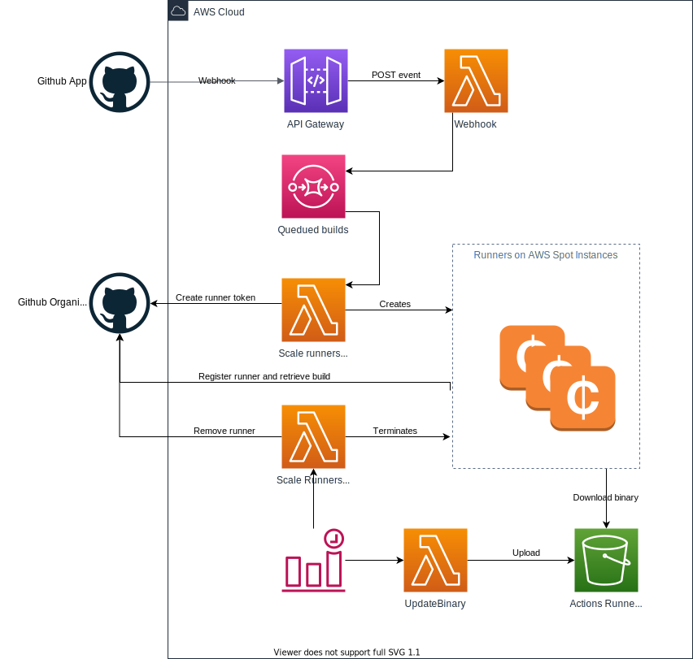

# Terraform module for scalable self hosted GitHub action runners

> WIP: Module is in development

This modules create the required infra structure needed to host GitHub Action self hosted runners on AWS spot instances. All logic required to handle the life cycle for an action runners are implemented in AWS Lambda functions.

## Motivation

GitHub action runners `self hosted` runners provides you with a flexible option to run you CI workloads on compute of your choice. Currently there is no option provided to automate the creation, and scaling of action runners. This module takes care of creating the AWS infra structure and provides lambda modules ot orchestrate the the life cycle of the action runners.

Lambda is chooses as runtime for two major reasons. First is allows to create small components with minimal access to AWS and GitHub. Secondly is provides a scalable setup for minimal costs that works on repo level and scales to Org level setup. The lambda's will create linux based EC2 instances with Docker to serve CI workloads that can run on linux and or Docker. The main goal is here to support Docker based wark loads.

A logical question would why not Kubernetes? In the current approach we stay close to the way the GitHub action runners are available today. The approach is to install the runner on a host where the required software is available. With this setup we stay quite close to th GitHub approach. Another logical choice could be AWS Auto Scaling groups. This choice would require typically much more permission on instance level to GitHub. And besides that, scaling up and down is not trivial.

## Overview

The process of scaling runners on demand starts by registering a GitHub App which delivers via a webhook a check run event to the API Gateway. The Gateway triggers a Lambda which will verify the signature and filter for queued build events. Accepted events are posted on a queue. Messages on this queue will be delayed for x seconds to give available runners the time to start a build.

In case the build is not started yet, and no limits are reach. The lambda requests a registration token for a new runner at GitHub, stores the token in SSM and starts an EC2 instance via a launch template. The EC2 instances installs the required software via a `user_data` script, fetch and delete the registration token from SSM.

Scaling down the runners is at the moment brute forced, every x minutes a Lambda is checking if a runner (instance) is not busy. In case the runner is not busy it will be removed from GitHub and AWS. At the moment there seems no other option to scale down more smooth.

Downloading the GitHub action distribution can be occasionally slow, up to 10 more minutes. Therefore a lambda is introduced that synchronize based on a schedule the binary from GitHub to a cache in S3. The EC2 will fetch the distribution form the cache instead of internet.



Permission are managed on several places. Below the most important ones. For details check the Terraform sources.

- The GitHub App requires access to actions and publish check events to AWS.
- The scale up lambda should have access to EC2 for creating and tagging instances.
- The scale down lambda should have access to EC2 to terminate instances.

Besides the permissions are required to S3, CloudWatch, SSM, and S3.

## Usages

Examples are provided in [the example directory](examples/). Please ensure you have installed the following tools.

- Terraform, or [tfenv](https://github.com/tfutils/tfenv).
- Bash shell or compatible.
- TODO: building lambda ?
- AWS cli

The module support twe main scenario's for running tha action runners. Running on repo level a runner will be dedicated to one repo only, no other repo can use the runner. On Org level you can use the runner(s) for all the org repo's. Before starting the deployment you have to choose one option.

The setup consists of running Terraform to create all AWS resources and configure the GitHub app. The problem here is that our Terraform module requires configuration parameters from the GitHub app and our GitHub app requires output parameters of Terraform. So first create the app, configure the basics, run terraform finalize the app configuration.

### Setup GitHub App (part 1)

The module requires a GitHub app. Go to GitHub and create a new app. Be-aware you can create apps your Org or for a user. For now we handle only the Org level app.

1. Create app in Github
2. Choose a name
3. Choose a website (mandatory, not required for the module).
4. Disable the webhook (for now).
5. Repository permissions, enable `Checks` to receive vents for now builds.
6. _Only for repo level runner!_ - Repository permissions, `Administration` - Read and Write (to register runner)
7. _Only for Org level runner!_ - Organization permissions, `Administration` - Read and Write (to register runner)
8. Save the new app.
9. Next generate a private key on the General page.
10. Make a note of the following app parameters: App Id and Client ID

### Setup terraform module

TODO

### Setup GitHub App (part 12

Go back to the GitHub App and update the following settings.

1. Enable the webhook.
2. Provide the webhook secret.
3. Enable the `Check` event for the webhook.

## Examples

## Philips Forest

This module is part of the Philips Forest.

```
                                                     ___                   _
                                                    / __\__  _ __ ___  ___| |_
                                                   / _\/ _ \| '__/ _ \/ __| __|
                                                  / / | (_) | | |  __/\__ \ |_
                                                  \/   \___/|_|  \___||___/\__|

                                                                 Infrastructure
```

Talk to the forestkeepers in the `forest`-channel on Slack.

[](https://philips-software-slackin.now.sh)
