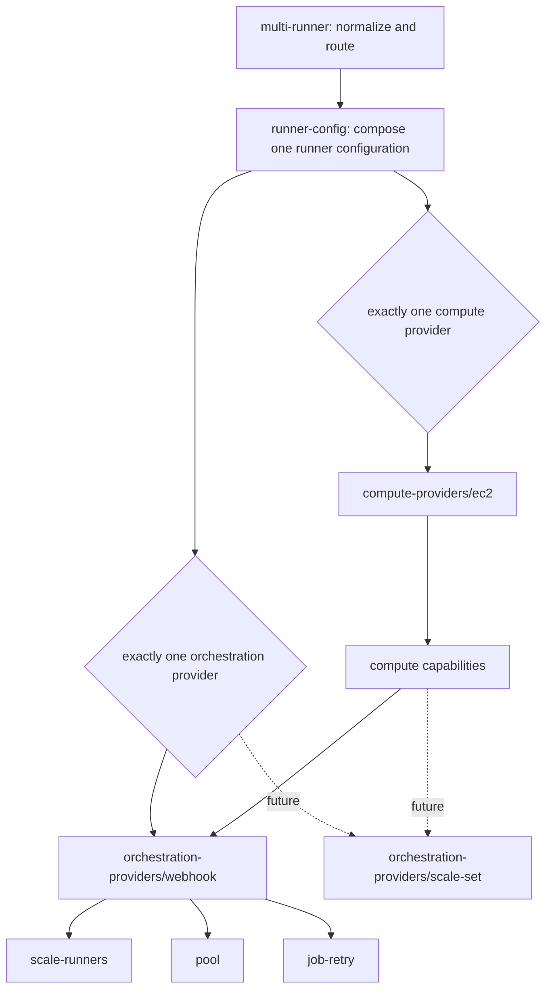

# ADR-002: Runner Orchestration Provider Boundary

## Status

Proposed

## Date

2026-08-15

## Context

The multi-runner module currently receives workflow-job demand through a shared GitHub webhook. A build queue then invokes scale-up, while scheduled Lambda functions handle scale-down, a runner pool, and queued-job retries. Those components evolved together and their settings are spread across shared module inputs and each runner entry.

That layout assumes every runner configuration uses the same demand-control model. It also makes the runner configuration module responsible for webhook-specific resources. Adding another model would require provider conditionals throughout the module or a second copy of the common runner and compute-provider wiring.

GitHub Actions Runner Scale Sets require a different control model. A future implementation is expected to use the runner scale-set and agent APIs, including:

- `_apis/runtime/runnerscalesets`
- `_apis/distributedtask/pools/0/agents`

Unlike the current event and schedule driven Lambda components, a scale-set controller maintains reconciliation state and long-lived coordination with GitHub. It may therefore need a containerized service, with ECS as a candidate deployment target, rather than another independent Lambda handler.

The Terraform contract should make that future addition possible without moving webhook fields a second time. This ADR defines that boundary. It does not implement the scale-set API client, controller, container image, or ECS resources.

## Terminology

- **Runner configuration**: One entry in `experimental.multi_runner_config`, including common runner behavior, one orchestration provider, and one compute provider.
- **Orchestration provider**: The implementation that receives or reconciles runner demand and owns the control components needed to turn that demand into capacity actions.
- **Compute provider**: The implementation that creates and manages runner capacity, such as EC2. It supplies capabilities to the selected orchestration provider.
- **Webhook orchestration**: The existing webhook, queue, scale-up, scale-down, pool, and job-retry implementation.
- **Scale-set orchestration**: A future stateful controller built on GitHub's runner scale-set APIs.

The public contract and documentation use “runner configuration.” They do not introduce a separate nickname for the existing implementation.

## Decision

We will introduce a typed orchestration-provider boundary in the experimental multi-runner v2 interface.

### Provider selection is per runner configuration

Every experimental runner configuration must contain an `orchestration_provider` object with exactly one non-null typed provider block. In this phase the only supported block is `webhook`:

```hcl
experimental = {
  multi_runner_config = {
    linux_arm64 = {
      orchestration_provider = {
        webhook = {
          runner = {
            boot_time_in_minutes = 5
            ephemeral            = true
            jit_config_enabled   = null
            maximum_count        = 4
          }

          github = {
            organization_runners = true
          }

          matcherConfig = {
            labelMatchers = [["linux", "arm64"]]
          }
        }
      }

      compute_provider = {
        ec2 = {
          instance_types = ["m7g.large"]
        }
      }
    }
  }
}
```

Selection is based on the populated provider block, not on a string discriminator. The wrapper's nullness must be known during planning because it determines the Terraform graph. Values inside the selected provider may remain unknown until apply.

Validation counts non-null provider blocks rather than naming one special case. A future provider can therefore be added as a sibling without changing the selection rule. Different runner configurations may select different providers once more than one exists, but one runner configuration cannot combine providers.

### Global orchestration blocks provide defaults; they do not select providers

`experimental.orchestration_provider.webhook` is the global defaults and shared-component namespace for webhook orchestration. Its presence does not select webhook orchestration for every runner configuration. Selection remains under `experimental.multi_runner_config.<configuration>.orchestration_provider`.

The webhook global namespace owns:

- the default runner boot timeout used by webhook scale-down and pool components;
- the default ephemeral and just-in-time registration lifecycle used by webhook controls and runner bootstrap;
- the default maximum runner count enforced by webhook scale-up and pool components;
- the repository allow list enforced by the shared webhook;
- queue-selection strategy, EventBridge routing, and matcher-parameter tier;
- build-queue defaults, redrive behavior, tags, and encryption;
- the shared webhook Lambda configuration and artifact selection;
- the runner-control artifact shared by scale, pool, and job-retry; and
- default scale-up, scale-down, and pool component settings.

Job-retry remains a per-runner-configuration webhook setting in this phase; its
typed block supplies its own defaults rather than inheriting a global block.

Runner boot time, ephemeral mode, JIT configuration, and maximum runner count are webhook-provider settings rather than common runner identity. Their canonical paths live under `experimental.orchestration_provider.webhook.runner`, with matching paths under `experimental.multi_runner_config.<configuration>.orchestration_provider.webhook.runner` for runner-configuration overrides. Stable-v1 translation maps the existing lifecycle, boot-time, and capacity inputs into those provider paths, and the unchanged stable `modules/runners` call reads from the canonical provider block. No compatibility aliases are retained under the experimental common `runner` object. The webhook provider resolves a null JIT setting to the effective ephemeral mode, exposes that lifecycle contract to runner-config bootstrap, injects boot time into scale-down and pool, and keeps these settings out of compute-provider capabilities.

The common `experimental.github` block continues to own credentials and GitHub API client settings shared across implementations, including `enterprise_server` and `user_agent`. Repository filtering belongs to the shared webhook at `experimental.orchestration_provider.webhook.github.repository_white_list`; per-configuration `organization_runners` remains in the same provider-owned GitHub block.

The common `experimental.lambda` block contains only provider-neutral Lambda substrate: runtime, architecture, networking, role settings, additional principals, tags, and an optional shared artifact bucket. It does not select a provider archive. Each component owner supplies its own local zip or S3 object key and version.

The webhook provider owns one runner-control artifact at `orchestration_provider.webhook.lambda.artifact`, shared by scale, pool, and job-retry. Its `lambda.scale` child contains only `up` and `down` configuration, while the ingress webhook retains its separate `lambda.webhook.artifact`. The provider-neutral SSM housekeeper owns its artifact selector under `ssm.housekeeper.lambda.artifact`. A runner-configuration selection overrides the global `experimental.ssm.housekeeper.lambda.artifact`; an S3 selection combines its key and optional object version with the common Lambda artifact bucket, a zip selection uses its local path, and no selection uses runner-config's packaged runner control-plane archive. This selector is independent of the webhook runner-control artifact. Stable-v1 translation maps the existing runner artifact into both canonical component contracts so the translated representation remains complete without changing the stable resource path.

For a selected webhook provider, resolution follows:

```text
runner-configuration override > experimental.orchestration_provider.webhook default
```

Tag maps merge from broad to narrow. A runner-configuration override affects only that runner configuration; it does not configure a shared singleton.

### Module ownership follows the provider boundary

The Terraform implementation is split as follows:

| Layer | Responsibility |
| --- | --- |
| `modules/multi-runner` | Selects stable or experimental mode, resolves global and runner-configuration values, owns shared webhook ingress and build queues, and routes typed provider objects. |
| `modules/runner-config` | Composes provider-neutral runner resources, selects exactly one orchestration provider and one compute provider, creates or selects the runner role, and connects provider capabilities. |
| `modules/orchestration-providers/webhook` | Owns webhook orchestration composition, provider defaults, tag layering, and the scale, pool, and retry leaf modules. |
| `modules/orchestration-providers/webhook/scale-runners` | Owns the scale-up and scale-down Lambdas, schedules, queue integration, IAM, and outputs. |
| `modules/orchestration-providers/webhook/pool` | Owns optional scheduled pool resources and IAM. |
| `modules/orchestration-providers/webhook/job-retry` | Owns optional queued-job retry resources and IAM. |
| `modules/runner-config/ssm-housekeeper` | Owns provider-neutral cleanup of runner token and configuration parameters, including its component-specific Lambda artifact. |
| `modules/compute-providers/<provider>` | Owns capacity resources and returns policy, environment-variable, trust-policy, and resource capabilities. |

The former `modules/runner-stack` name becomes `modules/runner-config`. “Runner configuration” describes the module's purpose without implying a specific deployment topology.



Provider leaf modules live below `modules/orchestration-providers/webhook`, not below `modules/runner-config`. This keeps the composition module small and prevents provider-owned resources from becoming a permanent part of the common contract.

### Compute providers expose capabilities, not orchestration resources

The selected compute provider remains independent from the selected orchestration provider. It returns the policy documents, environment variables, trust policy, managed-policy references, and resources needed by orchestration components.

`runner-config` adapts that provider output into the scale-up, scale-down, and pool capabilities consumed by webhook orchestration. The webhook provider owns its Lambda roles and attaches the capability fragments it needs. The compute provider does not create the common runner role or webhook resources.

This direction keeps the dependency graph one-way:

```text
runner-config -> compute provider -> capability contract -> orchestration provider
```

A future scale-set controller may require a different subset or extension of the capability contract. That extension belongs at the provider boundary; it must not add scale-set conditionals to the webhook leaves.

### Compatibility and state are explicit

Stable inputs are translated into the same internal canonical representation so defaults and shared singleton values have one resolution path. Stable runner configurations continue to call the existing `modules/runners` implementation at their existing addresses. Opting into experimental v2 is module-wide: a non-empty `experimental.multi_runner_config` replaces, rather than merges with, the stable map.

The runner configuration uses one explicitly named, count-addressed module per concrete provider. Compute modules follow `module.compute_<type>[0]`, while orchestration modules follow `module.orchestration_<type>[0]`. This avoids duplicating the provider name in addresses such as `module.webhook["webhook"]` and gives future providers symmetric addresses such as `module.compute_microvm[0]` and `module.orchestration_scale_set[0]`.

The experimental v2 implementation does not retain declarative moves from earlier unpublished module names. Those addresses are not part of the stable contract. An existing experimental deployment must migrate any affected state explicitly before upgrading or accept Terraform's proposed replacement actions.

The canonical v2 output groups resources under `orchestration_provider.webhook`. Direct `scale_up`, `scale_down`, and `pool` outputs remain compatibility aliases during the experimental transition.

This ADR does not define an automatic stable-v1-to-v2 state migration. Existing deployments remain on the stable path until that migration is separately designed and documented.

### Semantic validation lives beside module composition

Internal runner-config, orchestration-provider, and compute-provider modules keep nested variable declarations focused on types, defaults, and documentation. Their semantic and cross-field checks live in `validations.tf` as lifecycle preconditions on one empty `terraform_data.validate_config` resource per module. The resource has no `input` or `triggers_replace`, so configuration values are not copied into state and ordinary value changes do not replace it.

This convention requires Terraform 1.4 or newer and adds one state-only validation resource for each instantiated internal module. Known invalid values still fail during planning; unknown conditions may defer until apply, and targeted plans can omit a detached validation resource. Direct module tests therefore target and assert the validation resource explicitly.

### IAM and encryption follow resource ownership

Provider-owned IAM policies use conditional statements for optional KMS keys. A null key omits the statement; policies do not use placeholder account IDs, key IDs, or ARNs to satisfy Terraform typing.

Parameter Store and queue encryption are separate concerns:

| Key purpose | Consumer | Required KMS actions |
| --- | --- | --- |
| GitHub App parameters in Parameter Store | Scale-up, scale-down, pool, and job retry as applicable | `kms:Decrypt` |
| Encrypted build queue | Scale-up | `kms:Decrypt` |
| Encrypted build queue | Job retry when publishing a retry | `kms:Decrypt`, `kms:GenerateDataKey` |

Because queue KMS values are used as IAM `Resource` entries, the experimental queue contract requires a KMS key ARN when a customer-managed key is selected. SSM write access is scoped to the runner token and configuration paths. Wildcard resources are allowed only for AWS APIs that do not support resource-level permissions, such as the required X-Ray actions, and the policy must document that reason.

### Existing shared modules stay unchanged

This refactor does not change `modules/webhook` or `modules/ssm`.

The shared webhook remains at its existing unconditional module address. The shared SSM module continues to create or reference the webhook secret even when no runner configuration selects webhook orchestration. That singleton contract may support other uses and is independent of the per-runner exact-one provider selection.

Any later proposal to make those shared modules conditional is a separate compatibility and state decision.

### Scale-set implementation is deferred

No `scale_set` field is added to the Terraform type in this phase. The typed object and module layout reserve the extension point without publishing an incomplete contract.

A follow-up design must decide at least:

1. the public TypeScript SDK surface for runner scale-set and agent operations;
2. authentication, API-version negotiation, error mapping, retries, and idempotency;
3. the reconciliation and persistence model for desired, acquired, busy, and removed runners;
4. the controller's shutdown, recovery, concurrency, and high-availability behavior;
5. the container build and release contract for the TypeScript service;
6. whether ECS/Fargate is the default deployment and how networking, scaling, logging, health checks, and upgrades work;
7. the capabilities required from each compute provider; and
8. Terraform migration and coexistence behavior when the new provider is enabled.

The intended end state permits webhook and scale-set orchestration in the same multi-runner module instance when different runner configurations select them. It does not permit both controllers to own the same runner configuration.

## Consequences

### Positive

- A future orchestration provider becomes a sibling module instead of a cross-cutting conditional.
- Runner and compute-provider configuration remains reusable across demand-control models.
- Provider-owned queue, Lambda, artifact, IAM, and output settings have one discoverable namespace.
- Exact-one validation prevents ambiguous ownership of a runner configuration.
- Stable behavior and shared singleton addresses remain unchanged.
- Provider module addresses follow one consistent compute and orchestration naming convention.

### Negative

- The experimental input is more deeply nested than the existing flat interface.
- Global webhook defaults and per-runner webhook selection use similarly named blocks with different purposes.
- Internal modules have explicit adapter objects and capability contracts that require maintenance.
- Module-level validation resources add state-only objects and are not evaluated by a targeted plan that excludes them.
- Adding a stateful provider will still require new runtime, deployment, observability, and failure-recovery design; the Terraform boundary alone does not solve those concerns.
- Compatibility aliases temporarily expose both canonical and historical v2 output paths.

## Alternatives Considered

### Add a flat orchestration mode string

A value such as `orchestration_type = "webhook"` plus a flat collection of settings would make unrelated fields valid for every provider and require cross-field validation.

**Decision**: Use typed, nullable sibling blocks. The populated block both selects and configures the provider.

### Put provider conditionals directly in `runner-config`

This would keep fewer directories initially, but every provider would add resources, variables, IAM branches, and outputs to the common module.

**Decision**: Keep `runner-config` as a selector and composer. Put concrete resources under `modules/orchestration-providers/<provider>`.

### Keep webhook leaves under `runner-config`

Scale, pool, and retry are all webhook orchestration behavior. Leaving them under the common module would blur ownership and make a future provider appear to support components it does not use.

**Decision**: Move the leaves under the webhook provider root. Earlier experimental addresses are not retained as an in-module state-migration contract.

### Add the scale-set schema and ECS service now

Publishing placeholders would lock in names and types before the API client, reconciliation semantics, and runtime model have been validated.

**Decision**: Publish only the provider-neutral extension point now. Add the scale-set provider in a follow-up ADR and implementation.

### Make the shared webhook and webhook secret conditional

That change would alter existing singleton resource addresses and would conflate module-level ingress with per-runner provider selection.

**Decision**: Leave `modules/webhook` and `modules/ssm` unchanged in this refactor.

## Migration and Verification

Implementation and review must verify the boundary at several levels.

### Terraform contract tests

- A runner configuration with exactly one webhook provider plans successfully.
- Zero or multiple non-null orchestration providers fail with a focused validation message.
- Provider-wrapper nullness may shape the plan while values inside the selected provider may be unknown until apply.
- Per-runner values override global webhook defaults, and omitted nullable values inherit them.
- Shared singleton resources consume global values rather than arbitrary per-runner overrides.
- Stable inputs preserve stable resource addresses and output shape.
- Canonical runner-config, compute-provider, and orchestration-provider addresses are used consistently in fresh plans.
- Canonical nested outputs and compatibility aliases reference the same resources.

### Provider and IAM tests

- `runner-config` routes only the selected orchestration provider.
- The webhook root composes scale, pool, and retry leaves with the resolved values supplied by `multi-runner`; it does not invent fallback ARNs or empty resource objects.
- Compute-provider capability fragments reach the correct webhook component.
- Null SSM or queue KMS keys omit their IAM statements.
- Queue and Parameter Store KMS permissions remain separate and use the least actions required.
- SSM writes are limited to the configured token and runner-configuration paths.
- Existing wildcard queue-policy behavior remains unchanged by this refactor; new provider IAM permissions use exact resources unless AWS lacks resource scoping.

### Compatibility checks

- `modules/webhook` has no diff.
- `modules/ssm` has no diff.
- Stable multi-runner tests continue to pass.
- Experimental provider-routing, computed-input, runner-config, webhook-provider, scale, pool, retry, and SSM-housekeeper tests pass.
- Terraform formatting, documentation generation, and repository pre-commit checks are clean.

Before an existing experimental deployment adopts the module rename, its plan must be inspected for only the expected moved addresses. Stable deployments must not enable v2 until a stable-to-v2 migration procedure exists.

## References

- [Experimental compute-provider refactor](../modules/internal/compute-provider-refactor.md)
- [GitHub Actions Runner Scale Set reference implementation](https://github.com/actions/scaleset)
- [PR #5204 warm-pool proposal and ADR structure](https://github.com/github-aws-runners/terraform-aws-github-runner/pull/5204)
- [ADR-001 warm-pool decision in PR #5204](https://github.com/github-aws-runners/terraform-aws-github-runner/blob/feature/warm-pool-hibernation/docs/adr/001-warm-pool-hibernation.md)
- [ADR-001 warm-pool implementation plan in PR #5204](https://github.com/github-aws-runners/terraform-aws-github-runner/blob/feature/warm-pool-hibernation/docs/adr/001-warm-pool-implementation-plan.md)
