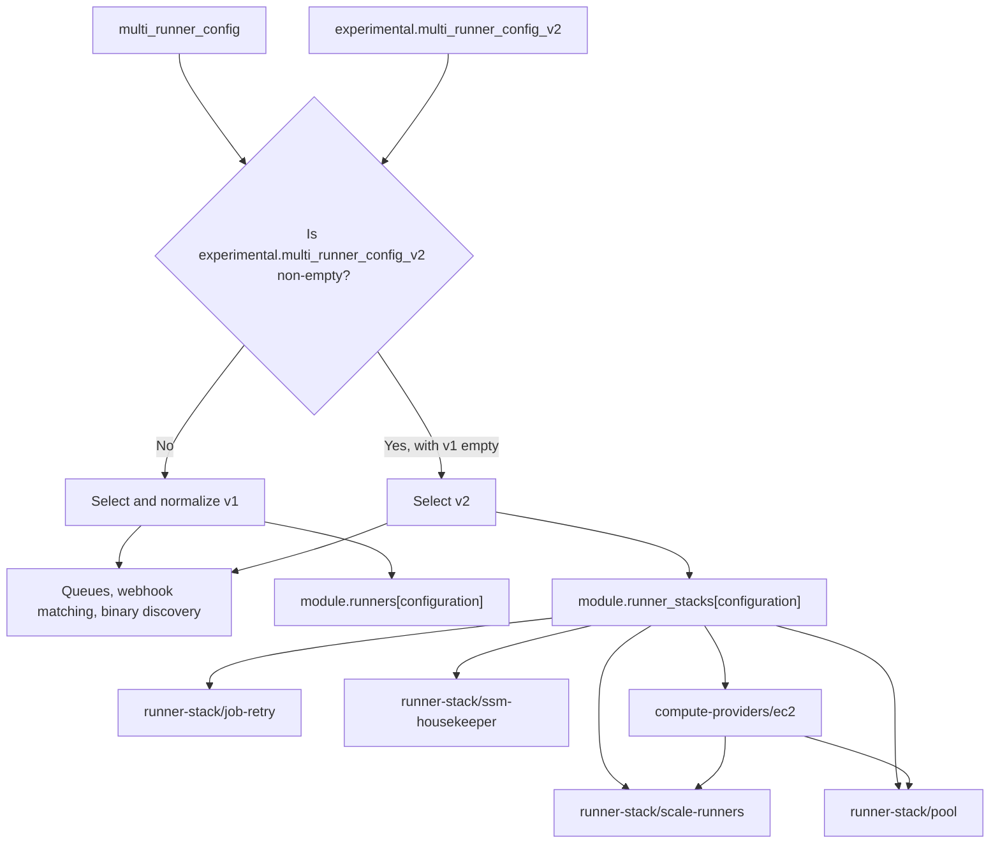

# Experimental compute-provider refactor

!!! warning "Experimental opt-in"

    The provider-oriented Terraform interface is experimental. Its schema can change before it becomes stable. To enable it for the whole module instance, leave `multi_runner_config` empty and populate `experimental.multi_runner_config_v2`. When the v2 map is empty, existing `multi_runner_config` deployments continue to use the unchanged legacy implementation. Populating both maps is unsupported.

## Why this refactor exists

The scale-up, scale-down, pool, job-retry, queue, SSM housekeeping, and GitHub registration workflows are not inherently EC2-specific. The legacy `runners` module combines that common control plane with EC2 launch templates, instance profiles, bootstrap parameters, log groups, IAM permissions, and Lambda environment variables. Adding another compute provider in that structure would require copying common behavior or adding provider conditionals throughout the module.

The refactor introduces a provider boundary so a future microVM or other backend can reuse the control plane. Only the policy statements, environment variables, and resources required by the selected compute provider should change.

## Ownership model

The implementation is split into orchestration, provider-neutral control-plane components, and compute-provider implementations:

| Layer | Owns |
| --- | --- |
| `multi-runner` | Module-level v1/v2 mode selection, canonical normalization, configuration keys, build queues, webhook matching, and runner-binary discovery. |
| `runner-stack` | Provider dispatch, internal component wiring, shared runner configuration in SSM, and the common runner role and policy attachments. |
| `runner-stack/scale-runners` | Provider-neutral scale-up and scale-down Lambdas, schedules and queue integration, and their execution roles and policies. |
| `runner-stack/pool` | Optional scheduled runner-pool resources and their Lambda and IAM wiring. |
| `runner-stack/job-retry` | Optional queued-job retry resources and their Lambda and IAM wiring. |
| `runner-stack/ssm-housekeeper` | Parameter Store cleanup Lambda, schedule, logging, and IAM resources. |
| `compute-providers/<provider>` | Provider-specific resources, runner-role policy requirements, and the IAM and environment-variable fragments consumed by the common control plane. |

The EC2 provider currently owns the instance profile, launch template, security group, AMI and bootstrap parameters, runner log groups, EC2 policy statements, and EC2 Lambda environment variables. EC2 is the only implemented Terraform compute provider today.

The modules below `runner-stack` are internal implementation boundaries, not standalone public modules. Callers opt into the experimental interface through `experimental.multi_runner_config_v2`; `multi-runner` calls `runner-stack`, which composes the internal modules. Their direct input and output contracts may change while v2 remains experimental.

`runner-stack` selects a compute provider from the single populated typed block under `compute_provider`. For example, `compute_provider = { ec2 = { ... } }` selects EC2; there is no separate `type` input that can disagree with the populated block. Exactly one provider block must be populated, and its presence must be known during planning because it determines the module graph. The stack passes `compute_provider.ec2` to the EC2 module as one nested `config` object. It also passes the provider-neutral `runner`, `github`, `ssm`, and `observability` objects without expanding them back into prefixed scalar inputs. This keeps ownership visible at the module boundary and gives future compute providers an equivalent contract to implement.

The common stack creates or selects the runner IAM role and owns the role trust relationship. The selected provider returns a single nested contract containing `policies.runner`, `policies.scale_up`, `policies.scale_down`, and `policies.pool`, along with component environment variables and provider resources. The common stack attaches those permission documents to the roles owned by the corresponding common components. A provider never creates or attaches a common IAM role.

The trust relationship is deliberately resolved before the provider is called:

1. `runner-stack` creates or selects the runner role using the service principal associated with the populated provider block.
2. The compute provider receives that role so it can create resources such as the EC2 instance profile and render `iam:PassRole` statements.
3. The provider returns its nested policy and environment-variable contract.
4. The common components attach the returned policies to the runner, scale-up, scale-down, and pool roles they own.

Returning the runner trust policy from the same resource-bearing provider module would create a Terraform dependency cycle: the role would depend on the provider output while the provider already depends on the role input. Keeping trust establishment in `runner-stack` and attaching provider permissions afterward preserves a one-way graph.

## Phase 1 dispatch and compatibility

Phase 1 exposes both contracts but requires callers to populate only one runner configuration map per module instance. An empty `experimental.multi_runner_config_v2` selects the stable v1 path. To select the experimental v2 path, `multi_runner_config` must be empty and the v2 map must be populated. The maps are never merged, and supplying both is unsupported.



The selected input is normalized once so shared resources can consume one representation. Stable normalization does not change stable runner dispatch:

- When `experimental.multi_runner_config_v2` is empty, every key in `multi_runner_config` continues to call `modules/runners` at its historical `module.runners["configuration"]` address.
- The stable module call receives the original v1 values for compatibility-sensitive inputs.
- Stable queue tagging and the flat `runners_map` output remain unchanged.
- When `multi_runner_config` is empty and `experimental.multi_runner_config_v2` is non-empty, every key in the v2 map calls `modules/runner-stack` at `module.runner_stacks["configuration"]`.
- Experimental resources are exposed separately through the nested `runners_map_v2` output.
- The maps are not combined, and there is no precedence rule between them. Populating both maps is unsupported.

No state move is included in phase 1. Enabling v2 for a module instance that already manages v1 runners changes its implementation addresses; phase 1 does not migrate that state. Existing deployments should keep v2 empty until the documented state-migration phase. The current v2 path is intended for new or explicitly experimental deployments.

## Opting in

Set the complete runner configuration map inside the nested experimental object to use the provider-oriented stack:

```hcl
module "multi_runner" {
  source = "github-aws-runners/github-runner/aws//modules/multi-runner"

  # A non-empty v2 map is the module-level experimental opt-in. Leave
  # multi_runner_config empty when using it.
  experimental = {
    multi_runner_config_v2 = {
      arm = {
        runner = {
          os            = "linux"
          architecture  = "arm64"
          maximum_count = 2
        }

        compute_provider = {
          ec2 = {
            instance_types = ["m7g.large"]
          }
        }

        matcherConfig = {
          labelMatchers = [["self-hosted", "linux", "arm64"]]
        }
      }
    }
  }
}
```

## Inputs, tags, and outputs

The v2 object groups provider-neutral settings by owner: `runner`, `github`, `queue`, `lambda`, `scale_up`, `scale_down`, `pool`, `job_retry`, `ssm`, and `observability`. Backend settings live only under `compute_provider.<provider>`. Exactly one typed provider block must be populated; that block selects the provider without a second discriminator field.

Tags follow the same ownership model. Module tags are defaults; shared Lambda, queue, and log-group tags override those defaults; component and subcomponent tags are applied last. EC2 runtime tags belong under `compute_provider.ec2.tags`. The EC2 bootstrap tags required by the runner are protected inside the provider and are not propagated to common resources.

Application logging settings stay together under `observability.logs`, including `level`, retention, encryption, class, and shared log-group tags.

In v1 mode, entries remain exclusively in `runners_map` and retain their flat output fields; `runners_map_v2` is empty. In v2 mode, entries are exposed exclusively through `runners_map_v2` and `runners_map` is empty. Common resources are grouped under `runner`, `scale_up`, `scale_down`, and `pool`, while provider-specific resources remain under `provider.<provider>`. For example, the common runner role is available at `runners_map_v2["configuration"].runner.role`, while EC2 launch-template and runner-log artifacts are under `runners_map_v2["configuration"].provider.ec2`. The populated provider key identifies the compute provider without a duplicate type field. The `pool` value is null when no pool configuration is supplied.

## Plan-time provider selection and ownership wrappers

Terraform must know resource and dynamic-block shape during planning, even when an ARN is produced by another resource and remains unknown until apply. Optional inputs that enable IAM policies therefore use a caller-known object as the discriminator and keep the computed value in an `arn` leaf. The relevant configuration fragments are:

```hcl
ssm = {
  kms_key = {
    arn = aws_kms_key.runner_parameters.arn
  }
}

compute_provider = {
  ec2 = {
    ami = {
      id_ssm_parameter = {
        arn = aws_ssm_parameter.runner_ami.arn
      }
      kms_key = {
        arn = aws_kms_key.runner_ami.arn
      }
    }
  }
}
```

The populated `ec2` block tells Terraform which provider module exists and must therefore be known during planning. Within that block, each ownership-wrapper object tells Terraform that the corresponding policy exists; its `arn` may safely be computed. Values such as `observability.logs.kms_key_id`, which configure an existing resource without changing graph shape, remain nullable scalar inputs.

For experimental multi-runner entries, set `ssm.kms_key` to the key that encrypts the shared GitHub App and runner parameters. The stable root `kms_key_arn` input continues to serve v1 and is not used as a graph-shape discriminator for v2.

## Migration phases

1. **Phase 1 — experimental opt-in:** Keep v1 unchanged when the v2 map is empty, or select v2 for the whole module instance when the v2 map is non-empty. Existing v1 deployments do not move and should not use the v2 switch as an in-place migration mechanism.
2. **Phase 2 — translate and migrate:** Deprecate the stable input, dispatch its translated representation through `runner-stack`, and provide tested `moved` blocks plus commands for addresses Terraform cannot move declaratively.
3. **Phase 3 — remove v1:** After a release window in which phase 2 is available, remove the stable input and flat output adapter in a breaking release.
4. **Future — retire `modules/runners`:** Handle direct consumers of the legacy module in a separate deprecation and migration effort.

A future compute provider must add a typed input block and return the same nested environment-variable, policy, and resource contract before it can be selected in Terraform. Populating more than one provider block, or selecting a block whose resources are not implemented, is intentionally rejected.
