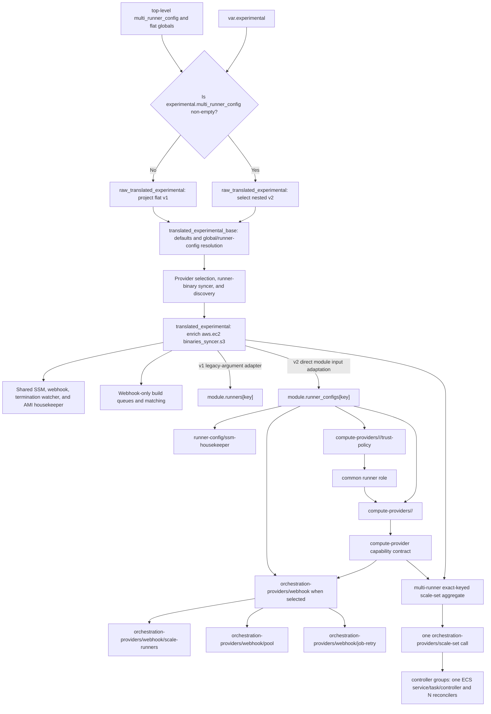

# Experimental orchestration- and compute-provider refactor

!!! warning "Experimental opt-in"

    The provider-oriented Terraform interface is experimental. Its schema can change before it becomes stable. A non-empty `experimental.multi_runner_config` enables it for the whole module instance and takes priority over the stable top-level `multi_runner_config`; the two maps are not combined. When the experimental map is empty, existing stable `multi_runner_config` deployments continue to use the unchanged legacy implementation.

## Why this refactor exists

The scale-up, scale-down, pool, job-retry, queue, SSM housekeeping, and GitHub registration workflows are not inherently EC2-specific. The legacy `runners` module combines webhook demand orchestration with EC2 launch templates, instance profiles, bootstrap parameters, log groups, IAM permissions, and Lambda environment variables. Adding another orchestration or compute provider in that structure would require copying common behavior or adding provider conditionals throughout the module.

The refactor introduces two typed boundaries. An orchestration provider owns the demand-control model and its components; a compute provider owns runner capacity and exports capabilities consumed by that orchestration. The scale-set controller now uses this boundary alongside webhook orchestration, and a future MicroVM backend can be added without moving public provider-owned settings or scattering provider conditionals through leaf modules; the central typed schema, normalization, routing, and dispatch still require extension.

## Ownership model

The implementation is split into common runner-config composition, orchestration-provider components, and compute-provider implementations:

| Layer | Owns |
| --- | --- |
| `multi-runner` | Module-level v1/v2 mode selection, flat/nested input projection, canonical global/runner-config resolution, typed orchestration- and compute-provider routing, config keys, webhook build queues and matching, runner-binary discovery, and the one aggregated scale-set provider call. |
| `runner-config` | Typed orchestration- and compute-provider dispatch, fixed scale-set JIT lifecycle selection, provider-neutral capability output, shared runner bootstrap config in SSM, the SSM housekeeper, and either a module-managed common runner role with policy attachments or selection of an external runner role. |
| `orchestration-providers/webhook` | Webhook defaults and tag layering, plus composition of the provider-owned control-plane leaves. |
| `orchestration-providers/webhook/scale-runners` | Compute-provider-neutral scale-up and scale-down Lambdas, schedules and queue integration, and their execution roles and policies. |
| `orchestration-providers/webhook/pool` | Optional scheduled runner-pool resources and their Lambda and IAM wiring. |
| `orchestration-providers/webhook/job-retry` | Optional queued-job retry resources and their Lambda and IAM wiring. |
| `orchestration-providers/scale-set` | Cross-runner controller grouping, non-secret reconciler manifests, ECS/Fargate services and task definitions, task IAM, private networking, health checks, and logging. |
| `runner-config/ssm-housekeeper` | Parameter Store cleanup Lambda, schedule, logging, and IAM resources. |
| `compute-providers/<namespace>/<provider>/trust-policy` | Provider-specific default runner-role trust, merged with the optional caller-provided trust document before the common role is created. |
| `compute-providers/<namespace>/<provider>` | Provider-specific resources, permission requirements, and the IAM and environment-variable fragments consumed by the common control plane after the runner role is resolved. |

The EC2 provider owns the instance profile, launch template, security group, AMI and EC2-specific bootstrap parameters, runner log groups, EC2 policy statements, and EC2 Lambda environment variables. EC2 is the only implemented Terraform compute provider in this phase.

Runner-config, the root orchestration and compute providers, and their leaf modules are internal implementation boundaries rather than standalone public modules. Callers opt into the experimental interface through `experimental.multi_runner_config`; `multi-runner` calls `runner-config`, which selects the provider modules. Their direct input and output contracts may change while v2 remains experimental.

Each external v2 runner config selects demand orchestration separately from its compute provider. The required `orchestration_provider` wrapper supports mutually exclusive `webhook` and `scale_set` siblings. Webhook owns lifecycle and maximum runner count, registration scope, matcher, build-queue overrides, scale-up, scale-down, pool, and job retry. Scale-set owns its GitHub scope and installation-ID reference, existing scale-set name and ID, desired capacity, boot timeout, and optional session owner and work folder. Exactly one sibling must be non-null.

Scale-set orchestration is adoption-only: the controller does not discover, create, or delete GitHub scale sets. Its ownership key is the canonical GitHub scope plus numeric scale-set ID. Validation rejects duplicates inside one multi-runner deployment, while operators must keep the tuple unique across deployments because independent Terraform states cannot detect one another. The controller uses only the primary App ID and private-key references derived from `experimental.github.app`; each selected runner config supplies the installation-ID Parameter Store reference for its own scope.

The runner config also populates exactly one typed compute-provider leaf, such as `experimental.multi_runner_config.<runner_config>.compute_provider.aws.ec2`; that leaf's presence must be known during planning because it determines capacity routing. Multi-runner resource preconditions enforce both selections and the public contract's cross-scope and plan-shaping rules, while each provider implementation validates its resolved internal contract.

After resolving global `experimental.compute_provider.aws.ec2` values with the selected runner config's `compute_provider.aws.ec2` overrides, `multi-runner` preserves the namespaced typed wrapper expected by `runner-config`. The direct contract is `compute_provider = { aws = { ec2 = { ... } } }`, not a flat EC2 object. Runner-config flattens each populated namespace and provider leaf into an internal dispatch key such as `aws_ec2`, validates that exactly one leaf is non-null, and passes `compute_provider.aws.ec2` to `module.compute_aws_ec2[0]` as its nested `config` object. The webhook runtime registry still receives the provider type `ec2`; the namespace is part of Terraform dispatch so different clouds can expose similarly named services without colliding. Runner-config independently validates exact-one orchestration selection. It calls `module.orchestration_webhook[0]` for webhook selections; for scale-set selections it applies fixed ephemeral JIT lifecycle settings and exposes `{ type, capabilities }` through `compute_provider_contract` without creating a controller child per runner config.

Binary discovery is completed before the runner-config call. `config.experimental.translation.tf` enriches the final canonical runner config at `compute_provider.aws.ec2.binaries_syncer.s3`, leaving `s3` null when synchronization is disabled. The `module.runner_configs` call then passes that runner config's wrapped `compute_provider` object unchanged. Runner-config and the EC2 provider therefore receive the typed provider-owned shape; neither expects a bare `{ arn, id, key }` object directly at `compute_provider.aws.ec2.binaries_syncer`.

Runner-config creates or selects the runner IAM role, but the current EC2 provider owns the role's default trust-policy document. Each provider implementation supplies a small `trust-policy` submodule that accepts `additional_trust_policy_json` and returns the final `assume_role_policy`. The full provider separately returns its nested `provider` contract containing the provider `type`, typed `capabilities`, legacy webhook policy/environment fragments, and provider resources. EC2's additive `capabilities.scale_set` contains provider-owned non-secret runtime JSON, environment variables, and structured IAM statements. It excludes GitHub scope and credentials, desired capacity, and boot timeout. When runner-config creates the runner role, it uses the isolated trust-policy output and attaches the returned runner policies. An external role bypasses both operations, so its caller owns trust and permissions. A provider never creates or attaches the common runner IAM role or an orchestration role.

The trust relationship is deliberately rendered by an isolated provider submodule:

1. `multi-runner` validates the runner config's typed orchestration- and compute-provider selections, resolves its global and per-runner-config values, and invokes `runner-config` with both wrapped provider configs.
2. `runner-config` independently derives the orchestration and compute providers from their single non-null typed blocks.
3. `compute-providers/<namespace>/<provider>/trust-policy` combines the provider default with `runner.iam.additional_trust_policy_json` without referencing the runner-role input.
4. `runner-config` creates the common runner role from the returned `assume_role_policy`, or selects an external role without applying that trust policy.
5. The full compute provider receives the resolved role so it can create resources such as the EC2 instance profile and render `iam:PassRole` statements.
6. The provider returns its nested type, capability, policy, environment-variable, and resource contract.
7. Runner-config attaches runner policies only to a module-managed runner role. `orchestration-providers/webhook` attaches scale-up, scale-down, and pool policy fragments to the roles it owns; multi-runner aggregates typed scale-set capabilities for the single scale-set provider call, whose controller groups own their task roles.

The trust-policy output depends only on its input documents, not on the full provider resources that consume the runner role. This preserves provider ownership of the trust relationship while keeping the dependency graph one-way.

## Selection and canonical translation

Multi-runner produces one canonical consumer representation for both input modes:

1. `config.experimental.translation.tf` selects the module mode and builds `local.raw_translated_experimental`. A non-empty experimental runner-config map selects the nested `var.experimental` input for v2; otherwise the file projects flat module globals and stable `multi_runner_config` entries into the same schema for v1.
2. The same translation file then derives `local.translated_experimental_base`. It applies schema defaults and global/runner-config precedence, merges tags, resolves IAM ownership and paths, and normalizes observability, both orchestration-provider siblings, and compute-provider values. Provider selection, plan-shaping validation, and the shared runner-binary syncer and discovery consume this fully resolved base.
3. After runner-binary discovery, the translation file derives the final `local.translated_experimental`. It completes runner labels, GitHub enterprise and User-Agent settings, shared Lambda artifacts and principals, the internal build-queue KMS projection and runner-control artifact, SSM KMS, and each enabled EC2 runner config's `compute_provider.aws.ec2.binaries_syncer.s3`. Webhook event-source mapping and pool resolution are already complete in the base object. The remaining shared components, webhook queues, and runner implementations consume the final canonical object.

Stable translation always emits `orchestration_provider.webhook` and an explicitly null `scale_set`, but stable runner configs remain on `module.runners["<runner_config>"]`: `runners.tf` adapts each final canonical runner config back to the existing `modules/runners` input contract, preserving Terraform addresses without maintaining a separate config source. For v2, `module.runner_configs` directly iterates the gated final runner-config map. Its adapter injects a live build queue only for webhook selections and passes only a plan-known marker for scale-set selection. The wrapped compute-provider object is forwarded unchanged. Multi-runner separately filters scale-set selections, gathers exact-keyed `compute_provider_contract` outputs, and calls `module.orchestration_scale_set[0]` once so grouping can span runner configs.

## Phase 1 dispatch and compatibility

Phase 1 exposes both contracts with deterministic module-level precedence. An empty `experimental.multi_runner_config` selects the stable v1 path. A non-empty experimental map selects the v2 path and takes priority over the stable top-level `multi_runner_config`; entries from the maps are never combined.



The canonical object gives shared singleton resources one global representation and each webhook orchestration and runner implementation one fully resolved runner-config representation:

- When `experimental.multi_runner_config` is empty, every key in the stable top-level `multi_runner_config` continues to call `modules/runners` at its historical `module.runners["<runner_config>"]` address.
- Flat v1 inputs are projected into `raw_translated_experimental`, resolved into `translated_experimental_base`, finalized as `translated_experimental`, and then adapted by `runners.tf` to the existing child-module arguments.
- The v1 translation uses `runners_scale_up_lambda_timeout` for build-queue visibility, preserving the stable flat behavior.
- The v1 translation wraps its existing registration scope, matcher, queue, scale, pool, and retry values under `orchestration_provider.webhook`; the stable public input and resource behavior remain unchanged.
- Stable queue tagging and the flat `runners_map` output remain unchanged.
- When `experimental.multi_runner_config` is non-empty, every key in the experimental map calls `modules/runner-config` at `module.runner_configs["<runner_config>"]`; stable-map entries are not dispatched.
- Experimental v2 uses `module.runner_configs["<runner_config>"]`; within each entry, the canonical provider child addresses are `module.runner_configs["<runner_config>"].module.compute_aws_ec2_trust_policy[0]`, `module.runner_configs["<runner_config>"].module.compute_aws_ec2[0]`, and `module.runner_configs["<runner_config>"].module.orchestration_webhook[0]`. Moved blocks inside `runner-config` preserve existing experimental state from the earlier `module.compute_ec2_trust_policy[0]` and `module.compute_ec2[0]` child labels when upgrading to these namespaced labels.
- Scale-set orchestration is aggregated outside the per-runner child at `module.orchestration_scale_set[0]`; no moved block is added for this new experimental path.
- Experimental resources are exposed separately through the nested `runners_map_v2` output.
- The maps are not combined. A non-empty v2 map has explicit priority over the stable map.

The provider-label moves are limited to the existing v2 child modules. No v1-to-v2 state move is included in phase 1. Enabling v2 for a module instance that already manages v1 runners changes its implementation addresses; phase 1 does not migrate that state. Moved blocks also cannot update Terraform expression references, so consumers must change the experimental output path from `provider.ec2` to `provider.aws.ec2`. Existing deployments should keep v2 empty until the documented state-migration phase. The current v2 path is intended for new or explicitly experimental deployments.

## Opting in

Nested global settings are the source of defaults for v2 runner configs and the applicable singleton shared components. The GitHub App Parameter Store module, webhook, scale-set controller, runner-binary syncer, termination watcher, and AMI housekeeper consume translated globals. Every v2 runner config selects exactly one of `orchestration_provider.webhook` and `orchestration_provider.scale_set`. Migrated v2 consumers do not fall back to matching flat inputs; those values seed the stable-mode translation only. The singleton-specific webhook, binary-syncer, termination-watcher, and AMI-housekeeper settings all have nested owners. Global scale-set settings own controller grouping, container, manifest storage, ECS, networking, logging, and tags; per-runner scale-set settings own scope, installation, identity, capacity, and boot time. Only module naming (`prefix`), `aws_partition`, and `aws_region` remain active flat-only inputs; legacy `iam_overrides` remains in the input schema but has no active consumer. Webhook runner configs contribute matcher, build-queue, and compute-provider routing data to the shared webhook. Scale-set runner configs contribute exact-keyed compute capabilities to the shared controller provider and create no build queue or matcher entry. An external `runner.iam.role` suppresses inherited IAM-management inputs because the module does not manage that role.

```hcl
module "multi_runner" {
  source = "github-aws-runners/github-runner/aws//modules/multi-runner"

  experimental = {
    # Base tags for v2 queues and runner configs and for translated singleton
    # resources such as shared SSM, webhook, binary syncer, watcher, and AMI
    # housekeeper.
    tags = {
      Workload  = "runner-configs"
      ManagedBy = "terraform"
    }

    roles = {
      path = "/github-actions/"
    }

    runner = {
      os           = "linux"
      architecture = "arm64"
    }

    github = {
      # Required in v2. Scale-set orchestration uses the primary app below;
      # additional_apps does not select a scale-set controller identity.
      app             = var.github_app
      additional_apps = var.additional_github_apps

      # The URL also configures the shared termination watcher. TLS verification
      # and the User-Agent remain runner-config GitHub-client settings.
      enterprise_server = {
        url        = var.ghes_url
        ssl_verify = true
      }
      user_agent = "github-aws-runners"
    }

    # Provider-neutral Lambda substrate shared by orchestration, runner SSM
    # housekeeping, and other singleton consumers.
    lambda = {
      runtime      = "nodejs24.x"
      architecture = "arm64"
      artifact = {
        s3 = {
          # Shared bucket only; every component selects its own object.
          bucket = var.lambda_artifact_bucket
        }
      }
      principals = var.additional_lambda_principals
    }

    # Global defaults are grouped by orchestration provider. This block does
    # not select a provider; each runner config has its own exact-one
    # orchestration selector below.
    orchestration_provider = {
      webhook = {
        runner = {
          boot_time_in_minutes = 5
          ephemeral            = true
          jit_config_enabled   = null
          maximum_count        = 4
        }

        github = {
          repository_white_list = [
            "example/example-repository",
          ]
        }

        queue_selection_strategy = "first"
        eventbridge = {
          enable        = true
          accept_events = []
        }
        matcher_config_parameter_store_tier = "Standard"

        lambda = {
          artifact = {
            # Use zip instead for a local archive. Leave both fields null for
            # the packaged runner archive shared by scale, pool, and job retry.
            zip = null
            s3 = {
              key            = "runner-config.zip"
              object_version = null
            }
          }

          # Component S3 wrappers select objects from the shared
          # experimental.lambda artifact bucket.
          webhook = {
            artifact = {
              zip = null
              s3 = {
                key            = "webhook.zip"
                object_version = null
              }
            }
            api_gateway_access_log_settings = {
              destination_arn = aws_cloudwatch_log_group.webhook_access.arn
              format          = "$context.requestId"
            }
            memory_size = 512
            timeout     = 10
            tags = {
              Component = "webhook"
            }
          }

          scale = {
            up = {
              memory_size = 1024
              event_source_mapping = {
                batch_size = 5
              }
            }
            down = {
              memory_size = 512
            }
          }

          pool = {
            memory_size = 512
          }
        }

        # Global webhook build-queue defaults. Visibility is independent of the
        # scale-up Lambda timeout and must remain at least six times that
        # timeout. Encryption is global-only; runner configs cannot override it.
        queue = {
          delay_webhook_event            = 30
          job_queue_retention_in_seconds = 86400
          visibility_timeout_seconds     = 180
          redrive_build_queue = {
            enabled         = false
            maxReceiveCount = null
          }
          tags = {
            QueueOwner = "platform"
          }
          encryption = {
            sqs_managed_sse_enabled           = null
            kms_master_key_id                 = aws_kms_key.github_app_parameters.arn
            kms_data_key_reuse_period_seconds = 300
          }
        }
      }

      # Shared controller topology. This block does not select scale-set
      # orchestration for a runner config.
      scale_set = {
        grouping = {
          strategy = "compute_provider"
        }
        container = {
          # Use an immutable image digest in production.
          image = var.scale_set_controller_image
        }
        network = {
          vpc_id     = var.vpc_id
          subnet_ids = var.controller_subnet_ids
        }
      }
    }

    # Shared resources append app/webhook. Runner configs append their key.
    ssm = {
      paths = {
        root    = "/github-actions"
        app     = "app"
        webhook = "webhook"
      }

      # This ARN-valued scalar may be unknown until apply. It encrypts shared
      # app parameters created by this module, configures the webhook, and
      # grants the selected runner-config or scale-set controller consumers
      # decrypt access. Existing *_ssm references retain external encryption.
      kms_key_id = aws_kms_key.github_app_parameters.arn

      parameters = {
        tags = {
          DataClass = "runner-runtime"
        }
      }

      housekeeper = {
        schedule_expression = "rate(12 hours)"
        lambda = {
          memory_size = 512
        }
      }
    }

    # Omitted observability fields retain the v2 schema defaults. For example,
    # metrics default to disabled with the "GitHub Runners" namespace, while
    # each individual metric switch defaults to enabled.
    observability = {
      logs = {
        level             = "info"
        retention_in_days = 30
        tags = {
          LogOwner = "platform"
        }
      }
      tracing = {
        mode = "Active"
      }
      metrics = {
        enable    = true
        namespace = "GitHub Runners"
      }
    }

    # Shared v2 EC2 defaults. This block neither selects EC2 nor supplies
    # required provider fields. Runner-binary settings are global because each
    # syncer is shared by runner configs with the same OS and architecture.
    compute_provider = {
      aws = {
        ec2 = {
          vpc_id     = var.vpc_id
          subnet_ids = var.subnet_ids

          ami = {
            housekeeper = {
              enabled = true
              cleanup_config = {
                minimumDaysOld = 30
                dryRun         = true
              }
              artifact = {
                zip = null
                s3 = {
                  key            = "ami-housekeeper.zip"
                  object_version = null
                }
              }
              lambda = {
                memory_size = 256
                timeout     = 300
              }
              schedule = {
                expression = "cron(11 7 * * ? *)"
              }
            }
          }

          instance_termination_watcher = {
            enabled = true
            features = {
              enable_spot_termination_handler              = true
              enable_spot_termination_notification_watcher = true
            }
            enable_runner_deregistration = true
            environment_variables        = {}
            artifact = {
              zip = null
              s3 = {
                key            = "termination-watcher.zip"
                object_version = null
              }
            }
            lambda = {
              memory_size = 512
              timeout     = 30
            }
          }

          runner_binaries = {
            enabled = true
            s3 = {
              encryption = {
                enabled            = true
                bucket_key_enabled = null
                sse_algorithm      = "AES256"
                kms_master_key_id  = null
              }
              tags       = {}
              versioning = "Disabled"
              logging = {
                bucket = null
                prefix = null
              }
            }
            syncer = {
              # Both null selects the packaged syncer archive. Set at most one.
              artifact = {
                zip = null
                s3  = null
              }
              lambda = {
                memory_size = 256
                timeout     = 300
              }
              schedule = {
                expression = "cron(27 * * * ? *)"
                state      = "ENABLED"
              }
            }
          }
        }
      }
    }

    multi_runner_config = {
      arm = {
        tags = {
          Environment = "arm-runners"
        }

        # Demand-control settings are selected through one typed webhook or
        # scale_set provider block.
        orchestration_provider = {
          webhook = {
            # This runner config overrides the webhook provider's global cap.
            runner = {
              boot_time_in_minutes = 7
              ephemeral            = true
              maximum_count        = 8
            }

            github = {
              organization_runners = true
            }
            lambda = {
              scale = {
                up = {
                  memory_size = 1536
                }
              }
            }
            matcherConfig = {
              labelMatchers = [["self-hosted", "linux", "arm64"]]
            }
          }
        }

        # A runner-config root is also a base; this resolves to
        # /github-actions/high-capacity/arm for this entry.
        ssm = {
          paths = {
            root = "/github-actions/high-capacity"
          }
          housekeeper = {
            lambda = {
              memory_size = 768
            }
          }
        }

        observability = {
          logs = {
            level = "debug"
          }
          metrics = {
            namespace = "GitHub Runners Arm"
          }
        }

        # Each runner config also selects exactly one compute provider and supplies its
        # provider-specific values here.
        compute_provider = {
          aws = {
            ec2 = {
              instance_types = ["m7g.large"]
            }
          }
        }
      }

      scale_set_linux = {
        runner = {
          architecture = "x64"
        }

        orchestration_provider = {
          scale_set = {
            github = {
              config_url = "https://github.com/example"
              installation_id_ssm = {
                name        = var.github_installation_id_parameter_name
                arn         = var.github_installation_id_parameter_arn
                kms_key_arn = var.github_installation_id_kms_key_arn
              }
            }
            name        = "linux-scale-set"
            id          = 101
            min_runners = 0
            max_runners = 20
          }
        }

        compute_provider = {
          aws = {
            ec2 = {
              instance_types = ["m7i.large"]
            }
          }
        }
      }
    }
  }
}
```

## Inputs, tags, and outputs

The `experimental` object has global siblings for `tags`, `roles`, `runner`, `github`, `lambda`, `orchestration_provider`, `ssm`, `observability`, and `compute_provider`, in addition to its runner-config map at `multi_runner_config`. Root `experimental.lambda` contains only provider-neutral shared Lambda substrate: the artifact bucket, runtime, architecture, principals, networking, role, and tag values. Global webhook-specific defaults are grouped under `experimental.orchestration_provider.webhook`: runner lifecycle, boot time, and maximum count; repository filtering; shared routing and matcher storage; queue defaults and encryption; the runner-control artifact shared by scale, pool, and job retry; and the ingress webhook, scale, and pool Lambda component settings. Global scale-set topology is grouped under `experimental.orchestration_provider.scale_set`: grouping, container runtime, config store, ECS, network, logging, and tags. These global orchestration blocks configure shared components but do not select a provider; each runner config's separate wrapper is the exact-one selector. The termination watcher, AMI housekeeper, and runner-binary syncer retain their nested component owners under `compute_provider.aws.ec2`. The active flat-only settings are `prefix`, `aws_partition`, and `aws_region`; legacy `iam_overrides` remains in the schema without an active consumer.

Each v2 runner config groups common provider-neutral settings by owner under `runner`, `lambda`, `ssm`, and `observability`; backend settings live under `compute_provider.<namespace>.<provider>`. Demand-control settings live under an exact-one `orchestration_provider` wrapper. `webhook` contains provider-owned lifecycle, capacity, matcher, queue, scale, pool, and retry settings. `scale_set` contains the GitHub config URL and installation-ID SSM reference, existing scale-set name and ID, capacity range, boot timeout, and optional session/work-folder settings. The fixed scale-set runner lifecycle is ephemeral with JIT enabled. Per-runner webhook precedence remains runner-config override followed by global nested value. Scale-set identity and capacity do not inherit global values; the global scale-set block owns only the shared controller topology. The shared webhook aggregates only webhook matchers, build queues, and compute routes. Multi-runner aggregates only scale-set entries and their exact-keyed compute capability contracts into the single scale-set provider call.

Global `experimental.orchestration_provider.webhook.queue` owns v2 build-queue defaults. `delay_webhook_event` defaults to `30`, `job_queue_retention_in_seconds` to `86400`, `visibility_timeout_seconds` to `180`, and `tags` to `{}`. `redrive_build_queue.enabled` defaults to `false`, while `redrive_build_queue.maxReceiveCount` defaults to null. A null per-runner-config redrive wrapper or leaf inherits its corresponding global value, and an enabled result requires a resolved `maxReceiveCount` greater than zero. Fields under `experimental.multi_runner_config[].orchestration_provider.webhook.queue` override those global defaults, and runner-config queue tags merge over global queue tags. Build-queue visibility is independent from Lambda config: `experimental.multi_runner_config[].orchestration_provider.webhook.lambda.scale.up.timeout` controls the function only, while `experimental.multi_runner_config[].orchestration_provider.webhook.queue.visibility_timeout_seconds` controls SQS and must be at least six times the resolved scale-up timeout.

Queue encryption is global-only. Omitting the entire `experimental.orchestration_provider.webhook.queue.encryption` block defaults `sqs_managed_sse_enabled` to `true` and the KMS fields to null, matching flat `queue_encryption`. If callers supply an explicit block, all three leaf keys are required: use explicit nulls for inactive fields, with a non-null SQS-managed switch for the non-KMS mode or a non-null `kms_master_key_id` for KMS mode. It configures the multi-runner build queues and their dead-letter queues, not the webhook provider's separate job-retry queue. Runner configs cannot override encryption. The queue CMK and `experimental.ssm.kms_key_id` are independent and are forwarded separately to `orchestration-providers/webhook`: scale-up receives queue-key `kms:Decrypt`, job-retry receives queue-key `kms:Decrypt` and `kms:GenerateDataKey`, and both retain separate Parameter Store decrypt statements. The existing shared `modules/webhook` contract remains unchanged and still requires caller-supplied key access when it publishes to customer-managed encrypted queues. Build queues and dead-letter queues continue to reuse the existing singleton `DenyInsecureTransport` queue policy; this refactor does not change its wildcard `Resource`. The v1 translation retains the flat contract: per-runner-config delay, retention, redrive, and tags keep their stable sources, build-queue visibility comes from `runners_scale_up_lambda_timeout`, and encryption comes from `queue_encryption`.

Global `experimental.github` owns the GitHub App credentials persisted or selected by shared SSM and used by v2 runner configs: `app` is required and `additional_apps` defaults to `[]`. Scale-set orchestration uses the primary App ID and private key from `app`; it does not select an entry from `additional_apps`. `experimental.orchestration_provider.webhook.github.repository_white_list` defaults to `[]` and filters the shared webhook when populated. `experimental.github.enterprise_server.url` defaults to `null`, `experimental.github.enterprise_server.ssl_verify` defaults to `true`, and `experimental.github.user_agent` defaults to `github-aws-runners`. The scale-set service scopes disabled TLS verification to each reconciler and places the configured user agent in the required structured protocol header's `system` field. Per-runner webhook `github.organization_runners` remains the registration-scope setting. Each scale-set runner config instead owns an HTTPS `github.config_url` and an existing `github.installation_id_ssm` reference because the primary App can use different installations for different organizations or repositories. Scale-set manifests contain only Parameter Store names, never credential values. The shared App ID and private key use global `ssm.kms_key_id`; an external installation-ID parameter declares its own optional `kms_key_arn`.

Shared SSM creates or selects Parameter Store credentials from the authoritative `experimental.github` object. Webhook runner configs consume the resulting references, and the aggregated scale-set provider forwards the primary App references to its selected reconcilers. Flat `github_app` and `additional_github_apps` seed only the stable-mode translation and impose no equality requirement in v2. The webhook does not make GitHub API requests.

Global `experimental.orchestration_provider.webhook` configures the shared webhook's queue-selection strategy, EventBridge implementation and accepted events, and matcher-configuration Parameter Store tier in addition to its queue and Lambda component defaults. `orchestration_provider.webhook.eventbridge.enable` and the matcher tier must be known during planning because they select module or parameter-chunk shape. `first` deterministically chooses the first equally matched queue by priority, `random` spreads jobs among equals, and `all` sends a job to every match at the cost of multiple runner launches and registrations.

Global `ssm.paths.root` is the base for shared GitHub App and webhook parameters and for every runner config. Shared resources append the global-only `ssm.paths.app` and `ssm.paths.webhook` segments, which default to `app` and `webhook`; normalization appends the runner-config key only for runner-config-owned roots, keeping runner parameters isolated. The derived global base defaults to `/github-action-runners/${prefix}`, while runner token and config segments default to `runners/tokens` and `runners/config`. Global `ssm.tags` augments the base tags on the shared Parameter Store module and also defaults runner-config-owned SSM tags; `ssm.parameters.tags` remains specific to Terraform-managed and runtime-created runner parameters. The global housekeeper defaults preserve the established schedule, enabled state, Lambda artifact, sizing, and cleanup behavior; a nullable per-runner-config field inherits those values. Avoid setting a global `ssm.housekeeper.config.tokenPath` unless every runner config is intentionally meant to clean the same path; omitting it lets each runner config derive its isolated token path.

Global `observability` values provide defaults for every runner config and configure the applicable shared singleton consumers. Log level, retention, KMS key, class, and tracing configure the webhook, runner-binary syncer, termination watcher, and AMI housekeeper; metrics also configure the termination watcher. The nested defaults preserve established behavior: logs use level `info`, 180-day retention, no customer-managed KMS key, and class `STANDARD`; tracing defaults to no mode with HTTP and error capture disabled; metrics default to disabled in the `GitHub Runners` namespace while the rate-limit, job-retry, Spot-termination, and Spot-warning switches default to enabled. The two Spot switches are global termination-watcher settings and have no per-runner-config override. Other nullable runner-config observability fields inherit the global value. `observability.logs.tags` remains specific to runner-config-owned log groups; shared singleton functions receive global `tags` and `lambda.tags`. The nullness of `observability.tracing.mode` must be known during planning because it selects X-Ray IAM statements and tracing blocks in runner-config consumers.

The global `experimental.compute_provider.aws.ec2` block owns v2 defaults for EC2 settings such as VPC and subnet IDs, managed-security-group behavior, egress rules, additional security groups, CloudWatch agent config, instance-profile path, key name, public IPv4 association, and tags. It also owns the shared AMI housekeeper, instance-termination watcher, and runner-binary distribution. It does not fall back to corresponding flat module inputs. VPC and subnet values must therefore be supplied through the global or per-runner-config `compute_provider.aws.ec2` block when needed. Global values should be set only when they are shared across every applicable runner config. The global `experimental.compute_provider` wrapper never selects a provider and does not contain provider-specific required runner-config fields outside its namespace leaves. Every runner config must still populate exactly one typed provider leaf; that per-runner-config leaf selects the provider, supplies required fields such as EC2 `instance_types`, and preserves the per-runner selection point needed for future mixed-provider maps.

`experimental.compute_provider.aws.ec2.runner_binaries` owns whether EC2 runner configs use the shared binary distribution by default, distribution-bucket encryption, tags, versioning and access logging, and syncer artifact, Lambda sizing, and schedule. A nullable per-runner-config `compute_provider.aws.ec2.binaries_syncer.enabled` overrides only the global enable default. The resolved enable value, `runner_binaries.s3.encryption.enabled`, the nullness of its `kms_master_key_id`, and the nullness of `runner_binaries.s3.logging.bucket` must be known during planning because they control module or resource shape. KMS encryption grants the syncer access to the distribution key, but runner roles do not derive `kms:Decrypt` from that field; callers must attach decrypt permission to the module-managed or external runner roles separately.

Webhook-orchestration runner-control artifacts are selected globally through `experimental.orchestration_provider.webhook.lambda.artifact.zip` or `experimental.orchestration_provider.webhook.lambda.artifact.s3.{key,object_version}` and shared by scale, pool, and job-retry. The S3 wrapper selects an object from the shared `experimental.lambda.artifact.s3.bucket`; null zip and S3 wrappers use the packaged runner archive. V2 validation rejects simultaneous zip and S3 selection and requires a non-null shared bucket and key when the S3 wrapper is present. Stable-mode translation preserves the old S3-wins rule by clearing the translated zip and creating the runner artifact's S3 wrapper whenever the flat `lambda_s3_bucket` is set. The shared bucket alone selects no component. Every artifact-capable singleton uses its own `artifact.s3` wrapper to supply that component's key and optional object version. Runner-config's common SSM housekeeper independently resolves `experimental.multi_runner_config[].ssm.housekeeper.lambda.artifact` over the global `experimental.ssm.housekeeper.lambda.artifact`; S3 combines the component key and version with the shared artifact bucket, zip uses the selected local path, and no selection uses the packaged control-plane archive. Stable translation maps the existing runner artifact into this separate canonical component contract. The ingress webhook artifact remains separate under `experimental.orchestration_provider.webhook.lambda.webhook.artifact`; the runner-binary syncer uses the parallel `experimental.compute_provider.aws.ec2.runner_binaries.syncer.artifact.{zip,s3}` selector, whose S3 key and optional object version resolve against the same shared bucket. `experimental.compute_provider.aws.ec2.instance_termination_watcher` owns watcher enablement, feature flags, runner deregistration, environment, artifact, and sizing. `experimental.compute_provider.aws.ec2.ami.housekeeper` owns enablement, cleanup behavior, artifact, sizing, and schedule. Watcher enablement and feature flags, runner-deregistration enablement, and AMI-housekeeper enablement must be known during planning because they control child resource shape.

Tags follow the same ownership model but merge rather than replace. Within v2 webhook queue and runner-config scopes, experimental global tags merge with runner-config tags and then with orchestration component or subcomponent tags from broad to narrow; a narrower value wins for a duplicate key. Singleton shared resources use only global scopes. Shared SSM merges `experimental.tags`, `ssm.tags`, and the forced `ghr:environment` tag. The webhook base resources merge `experimental.tags` with that environment tag. Scale-set resources merge experimental global tags, `orchestration_provider.scale_set.tags`, and the forced environment tag; config-store and log tags apply to their narrower resources. EC2 global provider tags merge with per-runner `compute_provider.aws.ec2.tags`. When scale-set orchestration is selected, runner-config rejects caller values for EC2 scale-set ownership and lifecycle tag keys so controller IAM conditions cannot be bypassed; webhook selections retain their existing tag contract. Provider-created instances carry `ghr:created_by=scale-set-service`. Because the unchanged termination watcher can match the same environment, multi-runner rejects watcher-based GitHub deregistration whenever a runner config selects scale-set orchestration; metrics-only watcher operation remains allowed.

Application logging settings stay together under `observability.logs`, including `level`, retention, encryption, class, and runner-config log-group tags. Tracing stays under `observability.tracing`, and metrics enablement, namespace, and individual metric switches stay under `observability.metrics`.

In v1 mode, entries remain exclusively in `runners_map` and retain their flat output fields; `runners_map_v2` is empty. In v2 mode, entries are exposed exclusively through `runners_map_v2` and `runners_map` is empty. Common resources are grouped under `runner`, orchestration selection or per-runner resources under `orchestration_provider.<provider>`, and provider-specific resources under `provider.<namespace>.<provider>`. The top-level per-runner `scale_up`, `scale_down`, and `pool` compatibility aliases are null in scale-set mode. Cross-runner controller resources are exposed once through the module's top-level `scale_set` output, with `controller_groups` keyed by the resolved grouping. No state move is added for this new experimental path.

## Plan-time provider selection and IAM shape

Terraform must know resource and dynamic-block shape during planning, even when an ARN is produced by another resource and remains unknown until apply. Provider ownership inputs continue to use caller-known wrapper objects as discriminators. The webhook orchestration leaves conditionally emit KMS statements from nullable Parameter Store and build-queue key scalars. Scale-set credential references use nullable scalar `kms_key_arn` fields; the provider composes their optional decrypt fragment into a static policy-document input, so an unknown ARN defers policy content without an unknown dynamic-block count or a sentinel ARN. At the internal runner-config boundary, the relevant config fragments are:

```hcl
ssm = {
  kms_key_id = aws_kms_key.runner_parameters.arn
}

compute_provider = {
  aws = {
    ec2 = {
      ami = {
        id_ssm_parameter = {
          arn = aws_ssm_parameter.runner_ami.arn
        }
        kms_key = {
          arn = aws_kms_key.runner_ami.arn
        }
      }
    }
  }
}
```

The populated `aws.ec2` leaf tells both multi-runner routing and runner-config dispatch which provider implementation exists and must therefore be known during planning. Canonical translation preserves both namespace levels, and the `module.runner_configs` input forwards the wrapper unchanged at the runner-config boundary. The `orchestration_provider` wrapper follows the same exact-one rule. Within the compute block, each ownership-wrapper object tells Terraform that the corresponding policy exists; its `arn` may safely be computed. At this internal boundary, `ssm.kms_key_id`, the derived `orchestration_provider.webhook.queue.kms_key_id`, and values such as `observability.logs.kms_key_id` remain nullable scalar inputs even when their ARNs are unknown until apply. The public source of the derived queue key is `experimental.orchestration_provider.webhook.queue.encryption.kms_master_key_id`.

For experimental multi-runner v2, global `experimental.ssm.kms_key_id` encrypts shared GitHub App parameters created by the module, configures the webhook, and authorizes selected controller consumers to decrypt the shared App ID and private key. External installation-ID references retain their own optional KMS declaration. The global key's value may be unknown until apply. It does not select encryption for runtime-created runner parameters or build queues. Queue encryption remains a separate webhook-only contract.

## Migration phases

1. **Phase 1 — v2 opt-in and canonical translation (current):** A non-empty experimental map opts the whole module instance into v2, while an empty map preserves the existing `module.runners["<runner_config>"]` addresses. Both stable and experimental inputs already resolve through the same canonical pipeline. The v2 switch is not an in-place state migration.
2. **Phase 2 — deprecate legacy variables:** Deprecate the stable `multi_runner_config` and migrated flat inputs while retaining both dispatch paths and compatibility outputs for a release window.
3. **Phase 3 — remove legacy variables and migrate state:** In a breaking release, remove the deprecated inputs and flat output adapter, route the remaining canonical configuration through `runner-config`, and ship tested `moved` blocks plus commands for addresses Terraform cannot move declaratively.
4. **Phase 4 — remove `modules/runners`:** After direct consumers have had a separate deprecation and migration window, delete the legacy module.

A future compute provider must add a typed external namespace and provider leaf, multi-runner normalization and routing, a provider-specific `trust-policy` submodule, runner-config dispatch, and an integration that returns the same nested environment-variable, policy, and resource contract before it can be selected in Terraform. Today the typed schema exposes only `aws.ec2`, so unsupported namespace or provider attributes fail input-schema validation. When another implemented leaf is added, the exact-one selection preconditions will reject runner configs that populate more than one supported compute provider.

An additional orchestration provider must add a typed global block where shared settings are needed, a typed per-runner selector block, runner-config selection behavior, capability support from each compatible compute provider, grouped outputs, and focused routing and coexistence tests. The existing exact-one validation automatically rejects any runner config that selects more than one supported orchestration provider.
