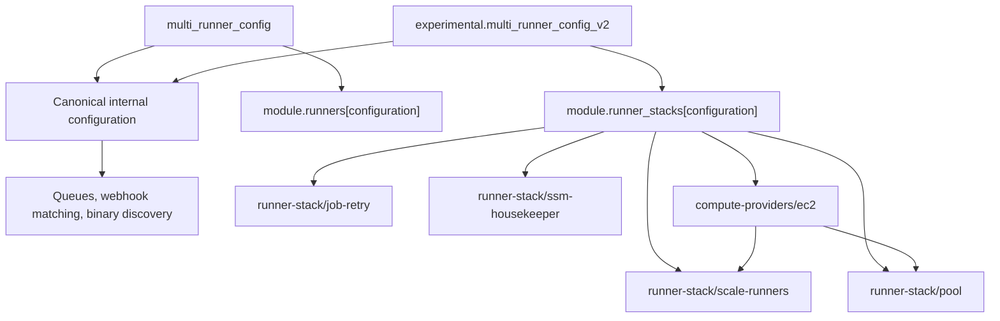

# Experimental compute-provider refactor

!!! warning "Experimental opt-in"

    The provider-oriented Terraform interface is experimental. It is enabled only by setting `experimental.multi_runner_config_v2`. Its schema can change before it becomes stable. Existing `multi_runner_config` deployments do not opt in and continue to use the legacy implementation.

## Why this refactor exists

The scale-up, scale-down, pool, job-retry, queue, SSM housekeeping, and GitHub registration workflows are not inherently EC2-specific. The legacy `runners` module combines that common control plane with EC2 launch templates, instance profiles, bootstrap parameters, log groups, IAM permissions, and Lambda environment variables. Adding another compute provider in that structure would require copying common behavior or adding provider conditionals throughout the module.

The refactor introduces a provider boundary so a future microVM or other backend can reuse the control plane. Only the policy statements, environment variables, and resources required by the selected compute provider should change.

## Ownership model

The implementation is split into orchestration, provider-neutral control-plane components, and compute-provider implementations:

| Layer | Owns |
| --- | --- |
| `multi-runner` | Stable-to-canonical normalization, configuration keys, build queues, webhook matching, and runner-binary discovery. |
| `runner-stack` | Provider dispatch, internal component wiring, shared runner configuration in SSM, and the common runner role and policy attachments. |
| `runner-stack/scale-runners` | Provider-neutral scale-up and scale-down Lambdas, schedules and queue integration, and their execution roles and policies. |
| `runner-stack/pool` | Optional scheduled runner-pool resources and their Lambda and IAM wiring. |
| `runner-stack/job-retry` | Optional queued-job retry resources and their Lambda and IAM wiring. |
| `runner-stack/ssm-housekeeper` | Parameter Store cleanup Lambda, schedule, logging, and IAM resources. |
| `compute-providers/<type>` | Provider-specific resources, runner-role policy requirements, and the IAM and environment-variable fragments consumed by the common control plane. |

The EC2 provider currently owns the instance profile, launch template, security group, AMI and bootstrap parameters, runner log groups, EC2 policy statements, and EC2 Lambda environment variables. EC2 is the only implemented Terraform compute provider today.

The modules below `runner-stack` are internal implementation boundaries, not standalone public modules. Callers opt into the experimental interface through `experimental.multi_runner_config_v2`; `multi-runner` calls `runner-stack`, which composes the internal modules. Their direct input and output contracts may change while v2 remains experimental.

`runner-stack` passes the canonical `compute_provider.ec2` configuration to the EC2 module as one nested `config` object. It also passes the provider-neutral `runner`, `github`, `ssm`, and `observability` objects without expanding them back into prefixed scalar inputs. The EC2 runner-role policy module consumes the same provider `config` and shared `ssm` boundaries. This keeps ownership visible at every module boundary and gives future compute providers an equivalent contract to implement.

The common stack creates or selects the runner IAM role. A provider supplies the trust policy, inline policy documents, and optional managed-policy requirements; the common stack attaches them. This keeps role ownership provider-neutral while allowing each compute provider to define its permissions.

## Phase 1 dispatch and compatibility

Phase 1 accepts stable and experimental configurations together, provided their keys do not overlap.



Stable input is translated once into the canonical internal shape so shared resources can consume one representation. That translation does not change stable runner dispatch:

- A key present in `multi_runner_config` continues to call `modules/runners` at its historical `module.runners["configuration"]` address.
- The stable module call receives the original v1 values for compatibility-sensitive inputs.
- Stable queue tagging and the flat `runners_map` output remain unchanged.
- A key present in `experimental.multi_runner_config_v2` calls `modules/runner-stack` at `module.runner_stacks["configuration"]`.
- Experimental resources are exposed separately through the nested `runners_map_v2` output.
- Duplicate keys are rejected instead of silently changing a module address or output shape.

No state move is included in phase 1. Moving an existing key from the stable map to the experimental map changes its implementation address and must wait for the documented state-migration phase.

## Opting in

Only configurations inside the nested experimental object use the provider-oriented stack:

```hcl
module "multi_runner" {
  source = "github-aws-runners/github-runner/aws//modules/multi-runner"

  # Existing configurations remain on modules/runners.
  multi_runner_config = {
    existing = {
      runner_config = {
        runner_os             = "linux"
        runner_architecture   = "x64"
        instance_types       = ["m5.large"]
        runners_maximum_count = 2
      }
      matcherConfig = {
        labelMatchers = [["self-hosted", "linux", "x64"]]
      }
    }
  }

  # Setting this nested map is the explicit experimental opt-in.
  experimental = {
    multi_runner_config_v2 = {
      arm = {
        runner = {
          os            = "linux"
          architecture  = "arm64"
          maximum_count = 2
        }

        compute_provider = {
          type = "ec2"
          ec2 = {
            instance_types = ["m7g.large"]
          }
        }

        matcherConfig = {
          labelMatchers = [["self-hosted", "linux", "arm64"]]
        }
      }
    }
  }
}
```

## Inputs, tags, and outputs

The v2 object groups provider-neutral settings by owner: `runner`, `github`, `queue`, `lambda`, `scale_up`, `scale_down`, `pool`, `job_retry`, `ssm`, and `observability`. Backend settings live only under `compute_provider.<type>`.

Tags follow the same ownership model. Module tags are defaults; shared Lambda, queue, and log-group tags override those defaults; component and subcomponent tags are applied last. EC2 runtime tags belong under `compute_provider.ec2.tags`. The EC2 bootstrap tags required by the runner are protected inside the provider and are not propagated to common resources.

Application logging settings stay together under `observability.logs`, including `level`, retention, encryption, class, and shared log-group tags.

Stable entries remain exclusively in `runners_map` and retain their flat output fields. Experimental entries are exposed exclusively through `runners_map_v2`; common resources are grouped under `runner`, `scale_up`, `scale_down`, and `pool`, while provider-specific resources remain under `provider.<type>`. For example, the common runner role is available at `runners_map_v2["configuration"].runner.role`, while EC2 launch-template and runner-log artifacts are under `runners_map_v2["configuration"].provider.ec2`. The `pool` value is null when no pool configuration is supplied. Keeping the maps separate prevents consumers from having to handle mixed entry schemas when v1 and v2 coexist.

## Plan-time ownership wrappers

Terraform must know resource and dynamic-block shape during planning, even when an ARN is produced by another resource and remains unknown until apply. Optional inputs that enable IAM policies therefore use a caller-known object as the discriminator and keep the computed value in an `arn` leaf. The relevant configuration fragments are:

```hcl
ssm = {
  kms_key = {
    arn = aws_kms_key.runner_parameters.arn
  }
}

compute_provider = {
  type = "ec2"
  ec2 = {
    ami = {
      id_ssm_parameter = {
        arn = aws_ssm_parameter.runner_ami.arn
      }
      kms_key = {
        arn = aws_kms_key.runner_ami.arn
      }
    }
  }
}
```

The object literal tells Terraform that the corresponding policy exists; its `arn` may safely be computed. Values such as `observability.logs.kms_key_id`, which configure an existing resource without changing graph shape, remain nullable scalar inputs.

For experimental multi-runner entries, set `ssm.kms_key` to the key that encrypts the shared GitHub App and runner parameters. The stable root `kms_key_arn` input continues to serve v1 and is not used as a graph-shape discriminator for v2.

## Migration phases

1. **Phase 1 — experimental opt-in:** Run stable and experimental configurations side by side. Stable resources and addresses do not move.
2. **Phase 2 — translate and migrate:** Deprecate the stable input, dispatch its translated representation through `runner-stack`, and provide tested `moved` blocks plus commands for addresses Terraform cannot move declaratively.
3. **Phase 3 — remove v1:** After a release window in which phase 2 is available, remove the stable input and flat output adapter in a breaking release.
4. **Future — retire `modules/runners`:** Handle direct consumers of the legacy module in a separate deprecation and migration effort.

A future compute provider must implement the same control-plane and runner-role contracts before it can be selected in Terraform. Adding a discriminator value without those resources is intentionally rejected.
