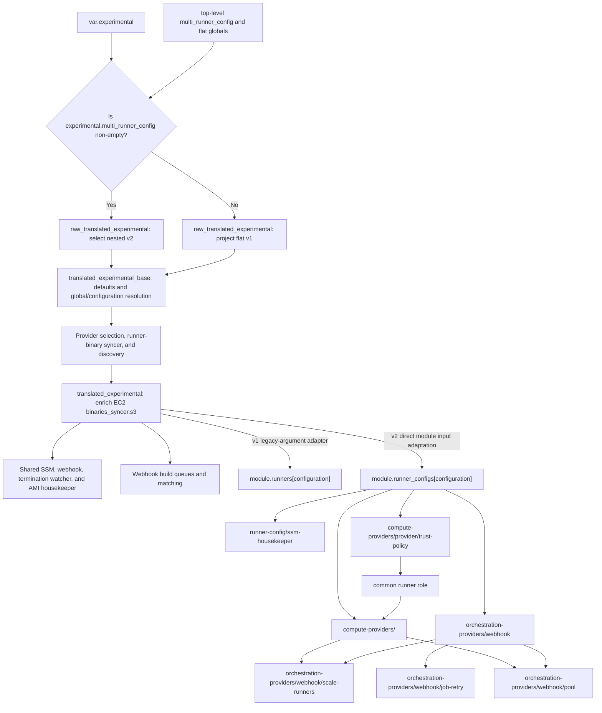

# Experimental compute-provider refactor

!!! warning "Experimental opt-in"

    The provider-oriented Terraform interface is experimental. Its schema can change before it becomes stable. A non-empty `experimental.multi_runner_config` enables it for the whole module instance and takes priority over the stable top-level `multi_runner_config`; the two maps are not combined. When the experimental map is empty, existing stable `multi_runner_config` deployments continue to use the unchanged legacy implementation.

## Why this refactor exists

The scale-up, scale-down, pool, job-retry, queue, SSM housekeeping, and GitHub registration workflows are not inherently EC2-specific. The legacy `runners` module combines that common control plane with EC2 launch templates, instance profiles, bootstrap parameters, log groups, IAM permissions, and Lambda environment variables. Adding another compute provider in that structure would require copying common behavior or adding provider conditionals throughout the module.

The refactor introduces a provider boundary so a future MicroVM or other backend can reuse the control plane. Only the policy statements, environment variables, and resources required by the selected compute provider should change.

## Ownership model

The implementation is split into demand-orchestration selection, provider-neutral control-plane components, and compute-provider implementations:

| Layer | Owns |
| --- | --- |
| `multi-runner` | Module-level v1/v2 mode selection, flat/nested input projection, canonical global/runner-configuration resolution, typed orchestration and compute-provider routing, configuration keys, webhook build queues and matching, and runner-binary discovery. |
| `runner-config` | Typed orchestration and compute-provider dispatch, shared runner configuration in SSM, the SSM housekeeper, and the common runner role and policy attachments. |
| `orchestration-providers/webhook` | Webhook-provider selection contract, defaults and tag layering, plus composition of the provider-owned control-plane leaves. |
| `orchestration-providers/webhook/scale-runners` | Provider-neutral scale-up and scale-down Lambdas, schedules and queue integration, and their execution roles and policies. |
| `orchestration-providers/webhook/pool` | Optional scheduled runner-pool resources and their Lambda and IAM wiring. |
| `orchestration-providers/webhook/job-retry` | Optional queued-job retry resources and their Lambda and IAM wiring. |
| `runner-config/ssm-housekeeper` | Parameter Store cleanup Lambda, schedule, logging, and IAM resources. |
| `compute-providers/<provider>/trust-policy` | Provider-specific default runner-role trust, merged with the optional caller-provided trust document before the common role is created. |
| `compute-providers/<provider>` | Provider-specific resources, permission requirements, and the IAM and environment-variable fragments consumed by the common control plane after the runner role is resolved. |

The EC2 provider owns the instance profile, launch template, security group, AMI and bootstrap parameters, runner log groups, EC2 policy statements, and EC2 Lambda environment variables. EC2 is the only implemented Terraform compute provider in this phase.

Runner-config, the root orchestration and compute providers, and their leaf modules are internal implementation boundaries rather than standalone public modules. Callers opt into the experimental interface through `experimental.multi_runner_config`; `multi-runner` calls `runner-config`, which selects the provider modules. Their direct input and output contracts may change while v2 remains experimental.

Each external v2 runner configuration selects demand orchestration separately from its compute provider. The required `orchestration` wrapper has one supported provider today: `experimental.multi_runner_config.<configuration>.orchestration.webhook`. It owns the runner configuration's maximum runner count, registration scope, matcher, build-queue overrides, scale-up, scale-down, pool, and job-retry settings. The wrapper is intentionally typed as a provider boundary so later orchestration implementations can be added as mutually exclusive siblings without moving common configuration fields again.

The runner configuration also populates exactly one typed compute-provider block, such as `experimental.multi_runner_config.<configuration>.compute_provider.ec2`; that block's presence must be known during planning because it determines capacity routing. Multi-runner module validation enforces both selections through resource preconditions, while each provider implementation owns its provider-specific semantic validation.

After resolving global `experimental.compute_provider.ec2` values with the selected runner configuration's `compute_provider.ec2` overrides, `multi-runner` preserves the typed wrapper expected by `runner-config`. The direct contract is `compute_provider = { ec2 = { ... } }`, not a flat EC2 object. Runner-config validates that exactly one compute-provider block is non-null, derives the provider type from that block, and passes `compute_provider.<provider>` to the selected provider module as its nested `config` object. It independently validates the exact-one `orchestration = { webhook = { ... } }` wrapper and invokes the selected root orchestration provider with provider-neutral common objects such as `runner`, the Lambda substrate, SSM, observability, and the selected compute-provider capabilities.

Binary discovery is completed before the runner-config call. `config.experimental.translation.tf` enriches the final canonical runner configuration at `compute_provider.ec2.binaries_syncer.s3`, leaving `s3` null when synchronization is disabled. The `module.runner_configs` call then passes that runner configuration's wrapped `compute_provider` object unchanged. Runner-config and the EC2 provider therefore receive the typed provider-owned shape; neither expects a bare `{ arn, id, key }` object directly at `compute_provider.binaries_syncer`.

Runner-config creates or selects the runner IAM role, but the current EC2 provider owns the role's default trust-policy document. Each provider implementation supplies a small `trust-policy` submodule that accepts `additional_trust_policy_json` and returns the final `assume_role_policy`. The full provider separately returns its nested `provider` contract containing `policies.runner`, `policies.scale_up`, `policies.scale_down`, and `policies.pool`, component environment variables, and provider resources. Runner-config uses the isolated trust-policy output when it creates the runner role, attaches runner policies itself, and passes the scale-up, scale-down, and pool capabilities to the selected orchestration provider. A provider never creates or attaches the common runner IAM role.

The trust relationship is deliberately rendered by an isolated provider submodule:

1. `multi-runner` validates the runner configuration's typed orchestration and compute-provider selections, resolves its global and per-configuration values, and invokes `runner-config` with both wrapped provider configurations.
2. `runner-config` independently derives the orchestration and compute providers from their single non-null typed blocks.
3. `compute-providers/<provider>/trust-policy` combines the provider default with `runner.iam.additional_trust_policy_json` without referencing the runner-role input.
4. `runner-config` creates or selects the common runner role from the returned `assume_role_policy`.
5. The full compute provider receives the resolved role so it can create resources such as the EC2 instance profile and render `iam:PassRole` statements.
6. The provider returns its nested policy, environment-variable, and resource contract.
7. Runner-config attaches runner policies, while `orchestration-providers/webhook` attaches scale-up, scale-down, and pool policy fragments to the roles it owns through its leaves.

The trust-policy output depends only on its input documents, not on the full provider resources that consume the runner role. This preserves provider ownership of the trust relationship while keeping the dependency graph one-way.

## Selection and canonical translation

Multi-runner produces one canonical consumer representation for both input modes:

1. `config.experimental.translation.tf` selects the module mode and builds `local.raw_translated_experimental`. A non-empty experimental runner-configuration map selects the nested `var.experimental` input for v2; otherwise the file projects flat module globals and stable `multi_runner_config` entries into the same schema for v1.
2. The same translation file then derives `local.translated_experimental_base`. It applies schema defaults and global/runner-configuration precedence, merges tags, resolves IAM ownership and paths, and normalizes observability, `orchestration.webhook`, and compute-provider values. Provider selection, plan-shaping validation, and the shared runner-binary syncer and discovery consume this fully resolved base.
3. After runner-binary discovery, the translation file derives the final `local.translated_experimental`. It completes runner labels, GitHub enterprise and User-Agent settings, webhook queue event mapping, Lambda artifact and principals, the webhook pool Lambda wrapper, SSM KMS, and each enabled EC2 runner configuration's `compute_provider.ec2.binaries_syncer.s3`. The remaining shared components, webhook queues, and runner implementations consume this final canonical object.

Stable translation always emits `orchestration.webhook`, but stable runner configurations remain on `module.runners["configuration"]`: `runners.tf` adapts each final canonical runner configuration back to the existing `modules/runners` input contract, preserving Terraform addresses without maintaining a separate configuration source. This is not the phase-2 implementation migration to `runner-config`. For v2, `module.runner_configs` directly iterates the gated final runner-configuration map. Its input arguments inline the environment tag and live GitHub App and build-queue references into `orchestration.webhook`, then forward the complete orchestration and compute-provider wrappers. Binary output enrichment and all other derived configuration shaping are already complete in canonical translation.

## Phase 1 dispatch and compatibility

Phase 1 exposes both contracts with deterministic module-level precedence. An empty `experimental.multi_runner_config` selects the stable v1 path. A non-empty experimental map selects the v2 path and takes priority over the stable top-level `multi_runner_config`; entries from the maps are never combined.



The canonical object gives shared singleton resources one global representation and each webhook orchestration and runner implementation one fully resolved runner-configuration representation:

- When `experimental.multi_runner_config` is empty, every key in the stable top-level `multi_runner_config` continues to call `modules/runners` at its historical `module.runners["configuration"]` address.
- Flat v1 inputs are projected into `raw_translated_experimental`, resolved into `translated_experimental_base`, finalized as `translated_experimental`, and then adapted by `runners.tf` to the existing child-module arguments.
- The v1 translation uses `runners_scale_up_lambda_timeout` for build-queue visibility, preserving the stable flat behavior.
- The v1 translation wraps its existing registration scope, matcher, queue, scale, pool, and retry values under `orchestration.webhook`; the stable public input and resource behavior remain unchanged.
- Stable queue tagging and the flat `runners_map` output remain unchanged.
- When `experimental.multi_runner_config` is non-empty, every key in the experimental map calls `modules/runner-config` at `module.runner_configs["configuration"]`; stable-map entries are not dispatched.
- Declarative `moved` blocks preserve the experimental call rename from `module.runner_stacks` to `module.runner_configs` and move the former runner-config scale, pool, and retry children directly beneath `module.webhook["webhook"]` without an intermediate state address.
- Experimental resources are exposed separately through the nested `runners_map_v2` output.
- The maps are not combined. A non-empty v2 map has explicit priority over the stable map.

No v1-to-v2 state move is included in phase 1. Enabling v2 for a module instance that already manages v1 runners changes its implementation addresses; phase 1 does not migrate that state. Existing deployments should keep v2 empty until the documented state-migration phase. The current v2 path is intended for new or explicitly experimental deployments.

## Opting in

Nested global settings are the source of defaults for v2 runner configurations and the applicable singleton shared components. The GitHub App Parameter Store module, webhook, runner-binary syncer, termination watcher, and AMI housekeeper consume translated globals. Every v2 runner configuration must currently select `orchestration.webhook`; no other orchestration provider is implemented. The wrapper is the durable provider boundary for future mutually exclusive siblings. Migrated v2 consumers do not fall back to matching flat inputs; those values seed the stable-mode translation only. The singleton-specific webhook, binary-syncer, termination-watcher, and AMI-housekeeper settings all have nested owners. Only module naming (`prefix`), `aws_partition`, and `aws_region` remain active flat-only inputs; legacy `iam_overrides` remains in the input schema but has no active consumer. Per-configuration values override globals only inside that runner configuration and never configure singleton resources. Nested defaults mirror established v1 behavior, while nullable runner-configuration fields inherit the corresponding global when omitted or set to null. Set a global override only when the value is genuinely shared by every runner configuration, and put configuration-specific differences in that configuration itself. An external `runner.iam.role` is the exception to normal inheritance: inherited managed policies and additional trust policy JSON are suppressed because the module does not manage that role.

```hcl
module "multi_runner" {
  source = "github-aws-runners/github-runner/aws//modules/multi-runner"

  experimental = {
    # Base tags for v2 queues and runner configurations and for translated singleton
    # resources such as shared SSM, webhook, binary syncer, watcher, and AMI
    # housekeeper.
    tags = {
      Workload  = "runner-configurations"
      ManagedBy = "terraform"
    }

    roles = {
      path = "/github-actions/"
    }

    runner = {
      os           = "linux"
      architecture = "arm64"
      ephemeral    = true
    }

    github = {
      # Required in v2. These nested values are authoritative for shared SSM
      # and every v2 runner configuration.
      app             = var.github_app
      additional_apps = var.additional_github_apps
      repository_white_list = [
        "example/example-repository",
      ]

      # The URL also configures the shared termination watcher. TLS verification
      # and the User-Agent remain runner-config GitHub-client settings.
      enterprise_server = {
        url        = var.ghes_url
        ssl_verify = true
      }
      user_agent = "github-aws-runners"
    }

    # Provider-neutral Lambda substrate shared by orchestration, runner SSM
    # housekeeping, and other singleton consumers.
    lambda = {
      runtime      = "nodejs24.x"
      architecture = "arm64"
      artifact = {
        s3 = {
          # Shared bucket only; every component selects its own object.
          bucket = var.lambda_artifact_bucket
        }
      }
      principals = var.additional_lambda_principals
    }

    # Global defaults are grouped by orchestration provider. This block does
    # not select a provider; each runner configuration has its own exact-one
    # orchestration selector below.
    orchestration = {
      webhook = {
        runner = {
          maximum_count = 4
        }

        queue_selection_strategy = "first"
        eventbridge = {
          enable        = true
          accept_events = []
        }
        matcher_config_parameter_store_tier = "Standard"

        lambda = {
          scale = {
            artifact = {
              # Use zip instead for a local archive. Leave both fields null for
              # the packaged runner archive.
              zip = null
              s3 = {
                key            = "runner-config.zip"
                object_version = null
              }
            }
          }

          # Component S3 wrappers select objects from the shared
          # experimental.lambda artifact bucket.
          webhook = {
            artifact = {
              zip = null
              s3 = {
                key            = "webhook.zip"
                object_version = null
              }
            }
            api_gateway_access_log_settings = {
              destination_arn = aws_cloudwatch_log_group.webhook_access.arn
              format          = "$context.requestId"
            }
            memory_size = 512
            timeout     = 10
            tags = {
              Component = "webhook"
            }
          }

          scale_up = {
            memory_size = 1024
            event_source_mapping = {
              batch_size = 5
            }
          }

          scale_down = {
            memory_size = 512
          }

          pool = {
            memory_size = 512
          }
        }

        # Global webhook build-queue defaults. Visibility is independent of the
        # scale-up Lambda timeout and must remain at least six times that
        # timeout. Encryption is global-only; runner configurations cannot override it.
        queue = {
          delay_webhook_event            = 30
          job_queue_retention_in_seconds = 86400
          visibility_timeout_seconds     = 180
          redrive_build_queue = {
            enabled         = false
            maxReceiveCount = null
          }
          tags = {
            QueueOwner = "platform"
          }
          encryption = {
            sqs_managed_sse_enabled           = null
            kms_master_key_id                 = aws_kms_key.github_app_parameters.arn
            kms_data_key_reuse_period_seconds = 300
          }
        }
      }
    }

    # Shared resources append app/webhook. Runner configurations append their key.
    ssm = {
      paths = {
        root    = "/github-actions"
        app     = "app"
        webhook = "webhook"
      }

      # This ARN-valued scalar may be unknown until apply. It encrypts shared
      # app parameters, configures the webhook, and grants runner-config
      # decrypt access.
      kms_key_id = aws_kms_key.github_app_parameters.arn

      parameters = {
        tags = {
          DataClass = "runner-runtime"
        }
      }

      housekeeper = {
        schedule_expression = "rate(12 hours)"
        lambda = {
          memory_size = 512
        }
      }
    }

    # Omitted observability fields retain the v2 schema defaults. For example,
    # metrics default to disabled with the "GitHub Runners" namespace, while
    # each individual metric switch defaults to enabled.
    observability = {
      logs = {
        level             = "info"
        retention_in_days = 30
        tags = {
          LogOwner = "platform"
        }
      }
      tracing = {
        mode = "Active"
      }
      metrics = {
        enable    = true
        namespace = "GitHub Runners"
      }
    }

    # Shared v2 EC2 defaults. This block neither selects EC2 nor supplies
    # required provider fields. Runner-binary settings are global because each
    # syncer is shared by runner configurations with the same OS and architecture.
    compute_provider = {
      ec2 = {
        vpc_id     = var.vpc_id
        subnet_ids = var.subnet_ids

        ami = {
          housekeeper = {
            enabled = true
            cleanup_config = {
              minimumDaysOld = 30
              dryRun         = true
            }
            artifact = {
              zip = null
              s3 = {
                key            = "ami-housekeeper.zip"
                object_version = null
              }
            }
            lambda = {
              memory_size = 256
              timeout     = 300
            }
            schedule = {
              expression = "cron(11 7 * * ? *)"
            }
          }
        }

        instance_termination_watcher = {
          enabled = true
          features = {
            enable_spot_termination_handler              = true
            enable_spot_termination_notification_watcher = true
          }
          enable_runner_deregistration = true
          environment_variables        = {}
          artifact = {
            zip = null
            s3 = {
              key            = "termination-watcher.zip"
              object_version = null
            }
          }
          lambda = {
            memory_size = 512
            timeout     = 30
          }
        }

        runner_binaries = {
          enabled = true
          s3 = {
            encryption = {
              enabled            = true
              bucket_key_enabled = null
              sse_algorithm      = "AES256"
              kms_master_key_id  = null
            }
            tags       = {}
            versioning = "Disabled"
            logging = {
              bucket = null
              prefix = null
            }
          }
          syncer = {
            # Both null selects the packaged syncer archive. Set at most one.
            artifact = {
              zip = null
              s3  = null
            }
            lambda = {
              memory_size = 256
              timeout     = 300
            }
            schedule = {
              expression = "cron(27 * * * ? *)"
              state      = "ENABLED"
            }
          }
        }
      }
    }

    multi_runner_config = {
      arm = {
        tags = {
          Environment = "arm-runners"
        }

        # Demand-control settings are selected through a typed orchestration
        # provider. Webhook is the only supported provider today; future
        # providers can be added as mutually exclusive siblings without moving
        # these fields again.
        orchestration = {
          webhook = {
            # This runner configuration overrides the webhook provider's global cap.
            runner = {
              maximum_count = 8
            }

            github = {
              organization_runners = true
            }
            lambda = {
              scale_up = {
                memory_size = 1536
              }
            }
            matcherConfig = {
              labelMatchers = [["self-hosted", "linux", "arm64"]]
            }
          }
        }

        # A runner-configuration root is also a base; this resolves to
        # /github-actions/high-capacity/arm for this entry.
        ssm = {
          paths = {
            root = "/github-actions/high-capacity"
          }
          housekeeper = {
            lambda = {
              memory_size = 768
            }
          }
        }

        observability = {
          logs = {
            level = "debug"
          }
          metrics = {
            namespace = "GitHub Runners Arm"
          }
        }

        # Each runner configuration also selects exactly one compute provider and supplies its
        # provider-specific values here.
        compute_provider = {
          ec2 = {
            instance_types = ["m7g.large"]
          }
        }
      }
    }
  }
}
```

## Inputs, tags, and outputs

The `experimental` object has global siblings for `tags`, `roles`, `runner`, `github`, `lambda`, `orchestration`, `ssm`, `observability`, and `compute_provider`, in addition to its runner-configuration map at `multi_runner_config`. Root `experimental.lambda` contains only provider-neutral shared Lambda substrate: the artifact bucket, runtime, architecture, principals, networking, role, and tag values. These settings configure v2 runner configurations and shared consumers beyond webhook orchestration, including the runner-binary syncer, termination watcher, AMI housekeeper, and per-configuration SSM housekeepers. `lambda.principals` configures v2 runner-config, runner-binary-syncer, termination-watcher, and AMI-housekeeper roles, but not the shared webhook role. Global webhook-specific defaults are grouped under `experimental.orchestration.webhook`: the maximum runner count, shared routing and matcher storage, queue defaults and encryption, runner-config scale artifact selection, and the webhook, scale-up, scale-down, and pool Lambda component settings. The global orchestration block is a defaults namespace, while each runner configuration's separate `orchestration` wrapper is the exact-one provider selector. The termination watcher, AMI housekeeper, and runner-binary syncer retain their nested component owners under `compute_provider.ec2`. The active flat-only settings are `prefix`, `aws_partition`, and `aws_region`; legacy `iam_overrides` remains in the schema without an active consumer.

Each v2 runner configuration groups common provider-neutral settings by owner under `runner`, `lambda`, `ssm`, and `observability`; backend settings live under `compute_provider.<provider>`. Demand-control settings live under a separate `orchestration` provider wrapper. Its sole supported block today is `orchestration.webhook`, containing `runner.maximum_count`, `github.organization_runners`, `matcherConfig`, `queue`, `lambda.scale_up`, `lambda.scale_down`, `lambda.pool`, and `job_retry`. A nullable per-configuration field inherits its corresponding experimental global when omitted or null, except that an external runner role suppresses inherited IAM management inputs. Precedence within a runner configuration is therefore a non-null configuration override followed by the global nested value, including that field's nested schema default. Per-configuration precedence does not extend to singleton shared resources: the webhook, runner-binary syncer, termination watcher, AMI housekeeper, and shared GitHub App Parameter Store module consume global translated values only. The runner-binary enable switch is an exception only in that it determines whether its OS/architecture pair participates in the shared syncer set; all syncer and distribution-bucket settings remain global.

Global `experimental.orchestration.webhook.queue` owns v2 build-queue defaults. `delay_webhook_event` defaults to `30`, `job_queue_retention_in_seconds` to `86400`, `visibility_timeout_seconds` to `180`, and `tags` to `{}`. `redrive_build_queue.enabled` defaults to `false`, while `redrive_build_queue.maxReceiveCount` defaults to null. A null per-configuration redrive wrapper or leaf inherits its corresponding global value, and an enabled result requires a resolved `maxReceiveCount` greater than zero. Fields under `experimental.multi_runner_config[].orchestration.webhook.queue` override those global defaults, and runner-configuration queue tags merge over global queue tags. Build-queue visibility is independent from Lambda configuration: `experimental.multi_runner_config[].orchestration.webhook.lambda.scale_up.timeout` controls the function only, while `experimental.multi_runner_config[].orchestration.webhook.queue.visibility_timeout_seconds` controls SQS and must be at least six times the resolved scale-up timeout.

Queue encryption is global-only. Omitting the entire `experimental.orchestration.webhook.queue.encryption` block defaults `sqs_managed_sse_enabled` to `true` and the KMS fields to null, matching flat `queue_encryption`. If callers supply an explicit block, all three leaf keys are required: use explicit nulls for inactive fields, with a non-null SQS-managed switch for the non-KMS mode or a non-null `kms_master_key_id` for KMS mode. It configures the multi-runner build queues and their dead-letter queues, not the webhook provider's separate job-retry queue. Runner configurations cannot override encryption. The queue CMK and `experimental.ssm.kms_key_id` are independent and are forwarded separately to `orchestration-providers/webhook`: scale-up receives queue-key `kms:Decrypt`, job-retry receives queue-key `kms:Decrypt` and `kms:GenerateDataKey`, and both retain separate Parameter Store decrypt statements. The existing shared `modules/webhook` contract remains unchanged and still requires caller-supplied key access when it publishes to customer-managed encrypted queues. The v1 translation retains the flat contract: per-configuration delay, retention, redrive, and tags keep their stable sources, build-queue visibility comes from `runners_scale_up_lambda_timeout`, and encryption comes from `queue_encryption`.

Global `experimental.github` owns the GitHub App credentials persisted or selected by shared SSM and used by v2 runner configurations: `app` is required and `additional_apps` defaults to `[]`. `github.repository_white_list` defaults to `[]` and filters the shared webhook when populated. `experimental.github.enterprise_server.url` defaults to `null` and configures both runner-config GitHub clients and the shared termination watcher. `experimental.github.enterprise_server.ssl_verify` defaults to `true`, and `experimental.github.user_agent` defaults to `github-aws-runners`; both remain runner-config client settings. Neither field is a root `experimental` sibling. Per-configuration `orchestration.webhook.github.organization_runners` is the separate registration-scope setting; runner configurations do not override credentials, repository filtering, the enterprise endpoint, or the User-Agent.

Shared SSM creates or selects Parameter Store credentials from the authoritative `experimental.github` object, and the webhook and every v2 runner configuration consume the resulting references. Flat `github_app` and `additional_github_apps` seed only the stable-mode translation and impose no equality requirement in v2. The webhook does not make GitHub API requests.

Global `experimental.orchestration.webhook` configures the shared webhook's queue-selection strategy, EventBridge implementation and accepted events, and matcher-configuration Parameter Store tier in addition to its queue and Lambda component defaults. `orchestration.webhook.eventbridge.enable` and the matcher tier must be known during planning because they select module or parameter-chunk shape. `first` deterministically chooses the first equally matched queue by priority, `random` spreads jobs among equals, and `all` sends a job to every match at the cost of multiple runner launches and registrations.

Global `ssm.paths.root` is the base for shared GitHub App and webhook parameters and for every runner configuration. Shared resources append the global-only `ssm.paths.app` and `ssm.paths.webhook` segments, which default to `app` and `webhook`; normalization appends the runner-configuration key only for configuration-owned roots, keeping runner parameters isolated. The derived global base defaults to `/github-action-runners/${prefix}`, while runner token and config segments default to `runners/tokens` and `runners/config`. Global `ssm.tags` augments the base tags on the shared Parameter Store module and also defaults configuration-owned SSM tags; `ssm.parameters.tags` remains specific to configuration-managed and runtime-created runner parameters. The global housekeeper defaults preserve the established schedule, enabled state, Lambda artifact, sizing, and cleanup behavior; a nullable per-configuration field inherits those values. Avoid setting a global `ssm.housekeeper.config.tokenPath` unless every runner configuration is intentionally meant to clean the same path; omitting it lets each runner configuration derive its isolated token path.

Global `observability` values provide defaults for every runner configuration and configure the applicable shared singleton consumers. Log level, retention, KMS key, class, and tracing configure the webhook, runner-binary syncer, termination watcher, and AMI housekeeper; metrics also configure the termination watcher. The nested defaults preserve established behavior: logs use level `info`, 180-day retention, no customer-managed KMS key, and class `STANDARD`; tracing defaults to no mode with HTTP and error capture disabled; metrics default to disabled in the `GitHub Runners` namespace while the rate-limit, job-retry, Spot-termination, and Spot-warning switches default to enabled. The two Spot switches are global termination-watcher settings and have no per-configuration override. Other nullable runner-configuration observability fields inherit the global value. `observability.logs.tags` remains specific to runner-config-owned log groups; shared singleton functions receive global `tags` and `lambda.tags`. The nullness of `observability.tracing.mode` must be known during planning because it selects X-Ray IAM statements and tracing blocks in runner-config consumers.

The global `experimental.compute_provider` block owns v2 defaults for EC2 settings such as VPC and subnet IDs, managed-security-group behavior, egress rules, additional security groups, CloudWatch agent configuration, instance-profile path, key name, public IPv4 association, and tags. It also owns the shared AMI housekeeper, instance-termination watcher, and runner-binary distribution. It does not fall back to corresponding flat module inputs. VPC and subnet values must therefore be supplied through the global or per-configuration EC2 block when needed. Global values should be set only when they are shared across every applicable runner configuration. The global block never selects a provider and does not contain provider-specific required runner-configuration fields. Every runner configuration must still populate exactly one typed provider block; that per-configuration block selects the provider, supplies required fields such as EC2 `instance_types`, and preserves support for mixed-provider maps.

`experimental.compute_provider.ec2.runner_binaries` owns whether EC2 runner configurations use the shared binary distribution by default, distribution-bucket encryption, tags, versioning and access logging, and syncer artifact, Lambda sizing, and schedule. A nullable per-configuration `compute_provider.ec2.binaries_syncer.enabled` overrides only the global enable default. The resolved enable value, `runner_binaries.s3.encryption.enabled`, the nullness of its `kms_master_key_id`, and the nullness of `runner_binaries.s3.logging.bucket` must be known during planning because they control module or resource shape. KMS encryption grants the syncer access to the distribution key, but runner roles do not derive `kms:Decrypt` from that field; callers must attach decrypt permission to the module-managed or external runner roles separately.

Webhook-orchestration runner-config artifacts are selected globally through `experimental.orchestration.webhook.lambda.scale.artifact.zip` or `experimental.orchestration.webhook.lambda.scale.artifact.s3.{key,object_version}`. The S3 wrapper selects an object from the shared `experimental.lambda.artifact.s3.bucket`; null zip and S3 wrappers use the packaged runner archive. V2 validation rejects simultaneous zip and S3 selection and requires a non-null shared bucket and key when the S3 wrapper is present. Stable-mode translation preserves the old S3-wins rule by clearing the translated zip and creating the runner artifact's S3 wrapper whenever the flat `lambda_s3_bucket` is set. The shared bucket alone selects no component. Every artifact-capable singleton uses its own `artifact.s3` wrapper to supply that component's key and optional object version. Runner-config's common SSM housekeeper independently resolves `multi_runner_config[].ssm.housekeeper.lambda.artifact` over the global `experimental.ssm.housekeeper.lambda.artifact`; S3 combines the component key and version with the shared artifact bucket, zip uses the selected local path, and no selection uses the packaged control-plane archive. Stable translation maps the existing runner artifact into this separate canonical component contract. The webhook artifact remains separate under `experimental.orchestration.webhook.lambda.webhook.artifact`; the runner-binary syncer uses the parallel `compute_provider.ec2.runner_binaries.syncer.artifact.{zip,s3}` selector, whose S3 key and optional object version resolve against the same shared bucket. `compute_provider.ec2.instance_termination_watcher` owns watcher enablement, feature flags, runner deregistration, environment, artifact, and sizing. `compute_provider.ec2.ami.housekeeper` owns enablement, cleanup behavior, artifact, sizing, and schedule. Watcher enablement and feature flags, runner-deregistration enablement, and AMI-housekeeper enablement must be known during planning because they control child resource shape.

Tags follow the same ownership model but merge rather than replace. Within v2 webhook queue and runner-config scopes, experimental global tags merge with runner-configuration tags and then with orchestration component or subcomponent tags from broad to narrow; a narrower value wins for a duplicate key. Singleton shared resources use only global scopes: shared SSM merges `experimental.tags` with `ssm.tags`, the webhook merges `experimental.lambda.tags` with `experimental.orchestration.webhook.lambda.webhook.tags`, and the runner-binary syncer, termination watcher, and AMI housekeeper receive global `tags` and `lambda.tags`. Distribution buckets additionally merge `compute_provider.ec2.runner_binaries.s3.tags`. EC2 global provider tags merge with per-configuration `compute_provider.ec2.tags`. EC2 runtime tags belong under `compute_provider.ec2.tags`; bootstrap tags required by the runner are reserved inside the provider and are not propagated to common resources.

Application logging settings stay together under `observability.logs`, including `level`, retention, encryption, class, and runner-configuration log-group tags. Tracing stays under `observability.tracing`, and metrics enablement, namespace, and individual metric switches stay under `observability.metrics`.

In v1 mode, entries remain exclusively in `runners_map` and retain their flat output fields; `runners_map_v2` is empty. In v2 mode, entries are exposed exclusively through `runners_map_v2` and `runners_map` is empty. Common resources are grouped under `runner`, demand-control resources under `orchestration.webhook`, and provider-specific resources under `provider.<provider>`. The provider key is derived from the selected typed compute-provider block. For example, the common runner role is available at `runners_map_v2["configuration"].runner.role`, scale-up resources at `runners_map_v2["configuration"].orchestration.webhook.scale_up`, and launch-template and runner-log artifacts under `runners_map_v2["configuration"].provider.ec2`. The webhook `pool` value is null when no pool configuration is supplied.

## Plan-time provider selection and IAM shape

Terraform must know resource and dynamic-block shape during planning, even when an ARN is produced by another resource and remains unknown until apply. Provider ownership inputs continue to use caller-known wrapper objects as discriminators. The webhook orchestration leaves conditionally emit KMS statements from the nullable Parameter Store and build-queue key scalars; a null value omits the statement, while an apply-time-unknown ARN remains valid during planning. No placeholder or sentinel ARN is rendered. The relevant configuration fragments are:

```hcl
ssm = {
  kms_key_id = aws_kms_key.runner_parameters.arn
}

compute_provider = {
  ec2 = {
    ami = {
      id_ssm_parameter = {
        arn = aws_ssm_parameter.runner_ami.arn
      }
      kms_key = {
        arn = aws_kms_key.runner_ami.arn
      }
    }
  }
}
```

The populated `ec2` block tells both multi-runner routing and runner-config dispatch which provider implementation exists and must therefore be known during planning. Canonical translation preserves that wrapper, and the `module.runner_configs` input forwards it unchanged at the runner-config boundary. The orchestration wrapper follows the same exact-one rule. Within the compute block, each ownership-wrapper object tells Terraform that the corresponding policy exists; its `arn` may safely be computed. `ssm.kms_key_id`, `orchestration.webhook.queue.kms_key_id`, and values such as `observability.logs.kms_key_id` remain nullable scalar inputs even when their ARNs are unknown until apply.

For experimental multi-runner v2, global `experimental.ssm.kms_key_id` encrypts the shared GitHub App parameters, configures the webhook with the same key, and adds matching decrypt permissions to every runner configuration so its control-plane functions can read those credentials. Its value may be unknown until apply. It does not select encryption for runtime-created runner parameters. Queue encryption is a separate global contract, may use a different CMK, and reaches only the scale-up consumer and job-retry publisher policies inside the webhook orchestration provider.

## Migration phases

1. **Phase 1 — v2 opt-in and canonical translation (current):** A non-empty experimental map opts the whole module instance into v2, while an empty map preserves the existing `module.runners["configuration"]` addresses. Both stable and experimental inputs already resolve through the same canonical pipeline. The v2 switch is not an in-place state migration.
2. **Phase 2 — deprecate legacy variables:** Deprecate the stable `multi_runner_config` and migrated flat inputs while retaining both dispatch paths and compatibility outputs for a release window.
3. **Phase 3 — remove legacy variables and migrate state:** In a breaking release, remove the deprecated inputs and flat output adapter, route the remaining canonical configuration through `runner-config`, and ship tested `moved` blocks plus commands for addresses Terraform cannot move declaratively.
4. **Phase 4 — remove `modules/runners`:** After direct consumers have had a separate deprecation and migration window, delete the legacy module.

A future compute provider must add a typed external input block, multi-runner normalization and routing, and an integration that returns the same nested environment-variable, policy, and resource contract before it can be selected in Terraform. Populating more than one external provider block, or selecting a block whose resources are not implemented, is intentionally rejected.
