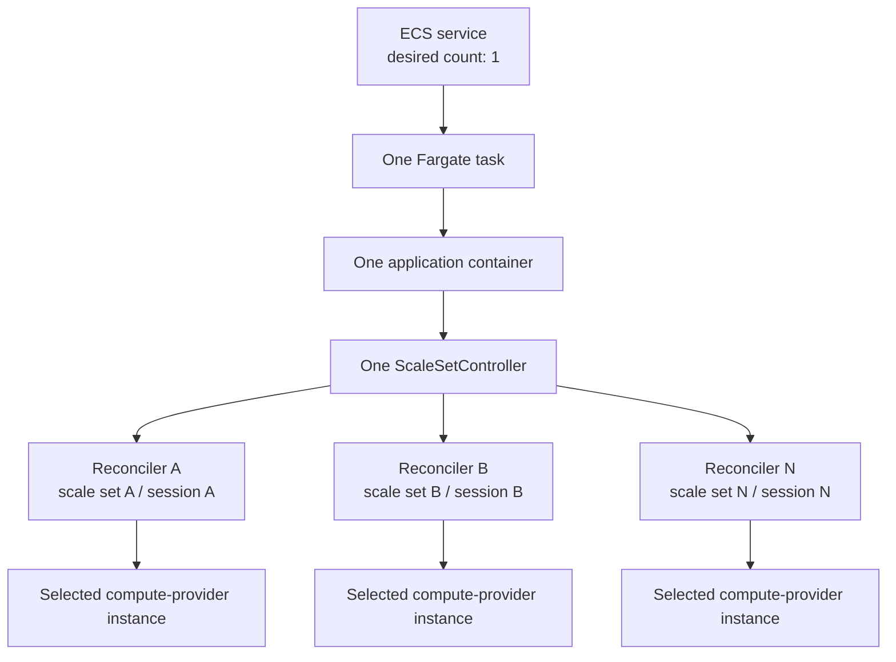

# Runner scale-set controller

!!! warning "Experimental v2"

    The scale-set controller is wired into the experimental multi-runner v2 interface through `experimental.multi_runner_config`. It is not available through the stable top-level `multi_runner_config`, and its API and state addresses may change while v2 remains experimental.

The controller is a long-running service because a GitHub runner scale set uses a message session and continuous reconciliation, rather than one Lambda invocation for each webhook event.

## Prerequisites and ownership

The provider adopts an existing GitHub runner scale set; it does not discover, create, or delete one. Before deployment, another provisioning step must create the scale set and supply its numeric ID, expected name, and optional runner-group ID. The controller verifies that identity before opening a message session and fails closed on any mismatch. Destroying the ECS controller does not delete the GitHub scale set or its registered runners.

Controller ownership is identified by the canonical GitHub scope and numeric scale-set ID. Canonicalization ignores URL case, one trailing slash, and the default HTTPS port. Terraform rejects a duplicate tuple within one multi-runner deployment. Operators must also keep that tuple unique across every deployment that can reach the same GitHub scope; separate Terraform states cannot detect one another and competing controllers would contend for the same message session.

The EC2 compute-provider module emits its non-secret runtime configuration and scoped task-role capability through `provider.capabilities.scale_set`. Runner-config exposes the selected compute capability, and multi-runner aggregates all scale-set selections into one orchestration-provider call before resolving controller groups. These contracts remain experimental rather than stable standalone module interfaces.

Before publishing a release that relies on the default GHCR image, verify that an unauthenticated client can pull the package. Repository-linked package visibility can inherit organization settings, so this must be checked from the published package rather than assumed from the workflow result.

## Experimental v2 contract

The global `experimental.orchestration_provider.scale_set` block configures the shared controller topology. Each runner config selects `orchestration_provider.scale_set` separately and supplies the existing GitHub scale-set identity and its installation-ID Parameter Store reference:

```hcl
module "multi_runner" {
  source = "github-aws-runners/github-runner/aws//modules/multi-runner"

  prefix = "example"

  experimental = {
    github = {
      app = var.github_app
    }

    orchestration_provider = {
      scale_set = {
        network = {
          vpc_id     = var.vpc_id
          subnet_ids = var.controller_subnet_ids
        }
      }
    }

    multi_runner_config = {
      linux = {
        orchestration_provider = {
          scale_set = {
            github = {
              config_url = "https://github.com/example"
              installation_id_ssm = {
                name        = var.github_installation_id_parameter_name
                arn         = var.github_installation_id_parameter_arn
                kms_key_arn = var.github_installation_id_kms_key_arn
              }
            }
            name        = "linux-runners"
            id          = 101
            min_runners = 0
            max_runners = 20
          }
        }

        compute_provider = {
          aws = {
            ec2 = {
              instance_types = ["m7g.large"]
            }
          }
        }
      }
    }
  }
}
```

The controller always uses the primary App ID and private-key references derived from `experimental.github.app`; it does not select an entry from `experimental.github.additional_apps`. Each runner config supplies its own `github.installation_id_ssm` reference because the primary App can have a different installation in each organization or repository. Terraform and the reconciler manifests carry only Parameter Store names and ARNs, never App credentials or installation-ID values.

`experimental.github.enterprise_server.ssl_verify` is serialized into every scale-set reconciler. A false value applies only to that reconciler's GitHub App and scale-set HTTP clients, so verified and self-signed GHES configurations can share one grouped task without changing process-global TLS behavior. `experimental.github.user_agent` is retained as the `system` identity inside GitHub's structured scale-set protocol User-Agent; it does not replace the protocol header.

## Deployment model

Multi-runner invokes `module.orchestration_scale_set[0]` once when at least one v2 runner config selects scale-set orchestration. That aggregate provider call packs the selected reconcilers into one or more controller groups. Every **controller group** has the same deployment shape:



The terms have distinct meanings:

- An **ECS service** keeps the group's desired task count at one and rolls task-definition revisions.
- A **task definition** is the immutable template for the container, IAM roles, health check, logs, and runtime settings.
- A **running task** is one deployment of that template.
- The task contains one **controller process**.
- The controller runs one independent **reconciler** and GitHub message session for every scale set assigned to the group.

A controller group is a packing, IAM, deployment, and failure boundary. It is not a GitHub runner group. Scaling an ECS service above one would create competing sessions for the same scale sets, so the module fixes the desired count at one.

Deployments are stop-first (`minimumHealthyPercent = 0`, `maximumPercent = 100`). This avoids overlapping the old and new message-session owners. It creates a short control-plane interruption during rollout; unacknowledged messages remain available for the replacement controller.

## Grouping strategies

The same runtime supports three grouping strategies. Every runner config must belong to exactly one group.

| Strategy | Behavior | Advantages | Costs |
| --- | --- | --- | --- |
| `compute_provider` | One group for each compute-provider type. This is the default. | Fewer ECS services and tasks; a natural default for provider-specific IAM and dependencies. | Configs of the same provider share rollout and process blast radius; the task role contains the union of their permissions. |
| `runner_config` | One group for every runner config. | Maximum isolation for IAM, health, logs, and deployment. | One ECS service, task definition, ENI, log group, and running-task cost per config. |
| `custom` | Explicit groups map to explicit runner-config sets. | Isolates sensitive or high-volume configs while packing smaller configs together. | The caller owns the grouping design and must account for the union of permissions and aggregate load in each group. |

Example custom assignment:

```hcl
grouping = {
  strategy = "custom"
  custom = {
    groups = {
      general = {
        runner_configs = ["linux-small", "linux-medium"]
      }
      isolated = {
        runner_configs = ["privileged-builds"]
      }
      microvm = {
        runner_configs = ["microvm-small", "microvm-large"]
      }
    }
  }
}
```

Future grouping algorithms should only produce the same normalized `group -> runner configs` mapping. The controller and provider contracts do not depend on how that mapping was selected.

## Runtime configuration and secrets

The Terraform module writes one non-secret `String` parameter per reconciler below the controller group's Parameter Store path. The ECS task receives only the group name, path, and revision. At startup the service loads the direct children of that path, validates their bounded versioned JSON, and creates the reconcilers.

The group manifest contains references to the GitHub App parameters, never their values. The task reads the exact referenced parameters and decrypts only their configured KMS keys. GitHub App credentials are refreshed without placing private keys, installation tokens, message-session tokens, messages, or JIT configurations in environment variables or logs.

Each group gets a separate task role. Its policy is the union of:

- the group's configuration path;
- the GitHub App parameter and optional KMS ARNs used by its members; and
- the selected scale-set capability fragments supplied by those members' compute providers.

Grouping therefore changes both the runtime blast radius and IAM scope. Large custom groups can also reach AWS inline-policy or API-rate quotas sooner.

## Compute-provider contract

Scale-set support is additive. It uses a separate `ScaleSetComputeProvider` registry instead of adding mandatory methods to the existing Lambda control-plane provider interface.

For every reconciliation, the controller supplies:

- the desired runner count;
- the orchestration-owned runner boot timeout;
- exact GitHub runner observations known to the controller;
- an explicit signal distinguishing lifecycle-only observations from a complete joined Actions and public GitHub inventory;
- a callback that creates a JIT configuration for an expected runner name; and
- a callback that removes only an exact runner ID, name, and scale-set match.

The selected compute provider owns capacity discovery, creation, provider tags/state, JIT publication, and safe termination. It must retain busy, ambiguous, or unknown capacity. This makes a restart fail safe: missing in-memory lifecycle state can leak capacity, but it must not cause a running job to be terminated.

A provider plugin may also declare bounded, non-secret process environment variables needed by its SDK or runtime adapter. Registration rejects reserved AWS, ECS, GitHub, Node.js, and controller namespaces, invalid names, control characters, oversized values, and conflicting grouped values. Per-runner configuration and all credentials remain in Parameter Store; the EC2 provider currently declares no additional process environment variables.

The initial EC2 implementation derives ownership from exact provider-created tags, including a SHA-256 hash of the canonical GitHub configuration scope, and never trusts a mutable GitHub runner ID alone. It only scales down an exact, currently idle runner.

A `config-published` instance counts as serving while it is inside the orchestration-owned boot window (`bootTimeoutMinutes`, default `10`) or after the controller observes an exact online or `JobStarted` identity. Once that window expires, the provider requests one complete inventory pass. Old offline, missing, ambiguous, or otherwise unknown capacity is retained, but no longer suppresses a replacement. The existing runner bootstrap does not provide a transactional "JIT configuration claimed" handshake, so an interrupted `provisioning` or `publishing` instance is also retained for operator recovery rather than terminated optimistically. Reconciliation may use at most one physical instance above desired capacity to restore serving capacity; it stops adding replacements at that limit so persistent ambiguity cannot create unbounded EC2 cost.

## EC2 lifecycle ownership

Scale-set-created EC2 instances carry `ghr:created_by=scale-set-service`, and their scale-set reconciler owns discovery, GitHub runner removal, and termination. The unchanged shared termination watcher can match the same environment, so a module instance containing scale-set runner configs rejects `instance_termination_watcher.enable_runner_deregistration = true`. The watcher may remain enabled with deregistration disabled for logging and metrics. Mixed deployments that require classic watcher deregistration need a separate deployment or filtering boundary that cannot match scale-set capacity.

## Health and operations

The container exposes two loopback endpoints:

- `/healthz` is liveness. Transient GitHub or AWS failures leave the process live while reconcilers back off, avoiding ECS restart loops.
- `/readyz` is readiness. It is successful only when every reconciler has an active, progressing session.

Terraform accepts only `/healthz` for `container.health_path`; `/readyz` cannot be selected as the ECS liveness probe. One reconciler can be degraded without terminating healthy reconcilers in the same group. Structured logs are the externally available signal for that partial failure today. `/readyz` is bound to loopback for a custom same-task observer; it is not currently exported through ECS Exec, a load balancer, or a CloudWatch metric. Graceful shutdown cancels polling and closes every message session within the ECS stop timeout.

## Container image

The repository builds `lambdas/services/scale-set/Dockerfile` for `linux/amd64` and `linux/arm64`. Releases publish the official image with an SBOM, provenance, and an attestation.

The Terraform module has a convenience `:latest` default and enables ECS image-version consistency. Production deployments should set `container.image` to the immutable digest printed in the release notes. The official GHCR package must be public for anonymous Fargate pulls; private ECR overrides must also provide the repository ARN so the execution role can receive the required pull permissions.
