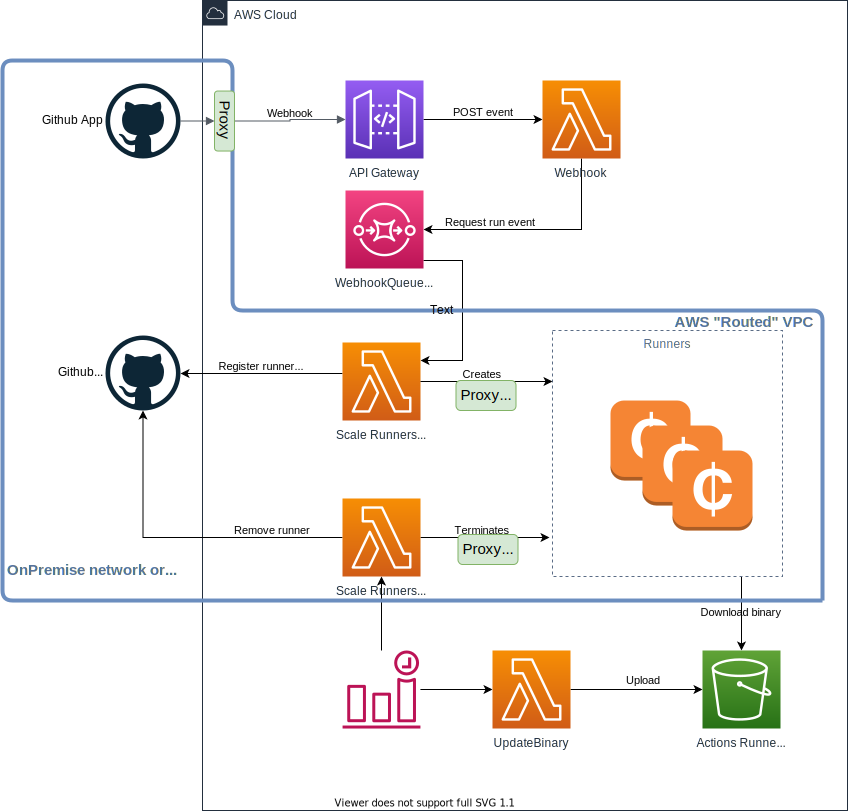

# Example on Ubuntu with On-premise GHES using network http proxy

**Disclaimer**: This example is currently more a proof of concept ;

- GitHub Enterprise Server v3.3 would be better than v3.2 to use
- All runners are currently instantiated "as organization" even if "enterprise endpoint" is used (GHES action runners at enterprise level not now implemented) => runners are not correctly removed (stay offline)
- The runner registration is done with an admin personal access token
- Follow issue [#1303](https://github.com/philips-labs/terraform-aws-github-runner/issues/1303) for more 

This (part example) module shows how to create GitHub action runners using an Ubuntu AMI when GitHub Enterprise Server is On-premise (or a routed VPC) which should use a network HTTP proxy for internet connection (for security reasons). Lambda release is not part of this example.

Use case:

- Scale Runners (up/down) lambda should be on same network as GitHub Enterprise Server (DNS resolution), so have no direct access connection (should use proxy)
- AWS EC2 VM have no direct access connection

**Precision**: The proxy configuration is stored as environment variable in Lambdas configuration, even if contains potential sensitive data (login/password in URL). It could not be otherwise, Lambdas have no access to SSM for sample.  

Components architecture:

The [user-data.sh](templates/user-data.sh) script is the custom initialization of EC2 virtual machine. Mainly a GitHub Action Runner installation (could be on AMI), configuration, start. The content is a mix of:

- The originals [user-data.sh](https://github.com/philips-labs/terraform-aws-github-runner/blob/develop/modules/runners/templates/user-data.sh) & [install-config-runner.sh](https://github.com/philips-labs/terraform-aws-github-runner/blob/develop/modules/runners/templates/install-config-runner.sh)
- The [user-data.sh](https://github.com/philips-labs/terraform-aws-github-runner/blob/develop/examples/ubuntu/templates/user-data.sh) Ubuntu sample

## Usages

This template is not usable *"as it"*, it is a template which focus on GitHub action runners at Enterprise Level on an On-Premise GitHub Enterprise Server with deployment on a routed AWS VPC (which can communicate with your On-Premise network).
 
